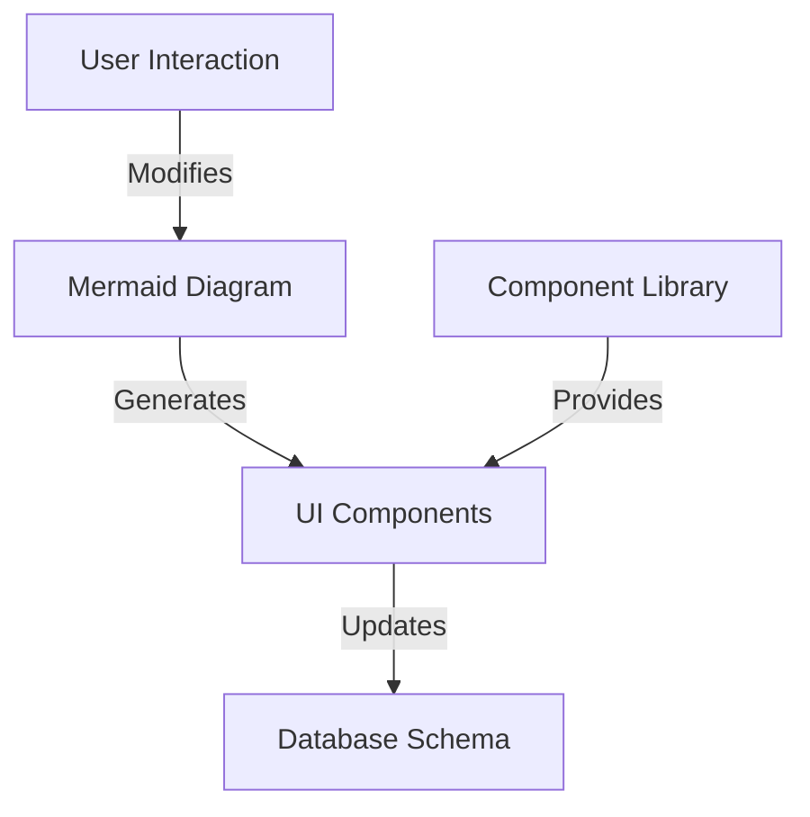
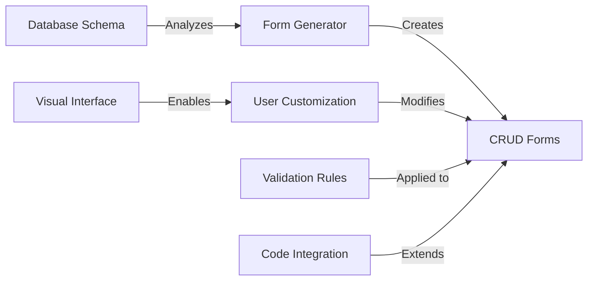
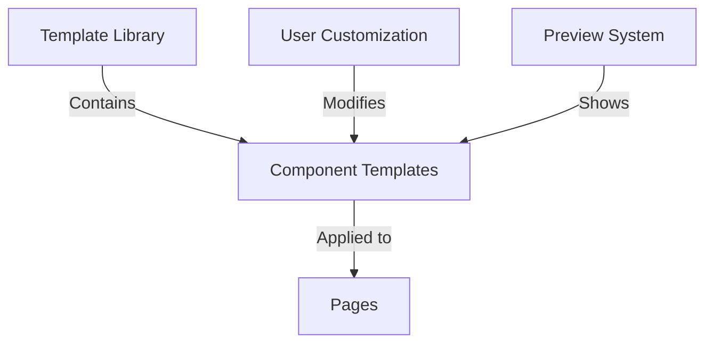
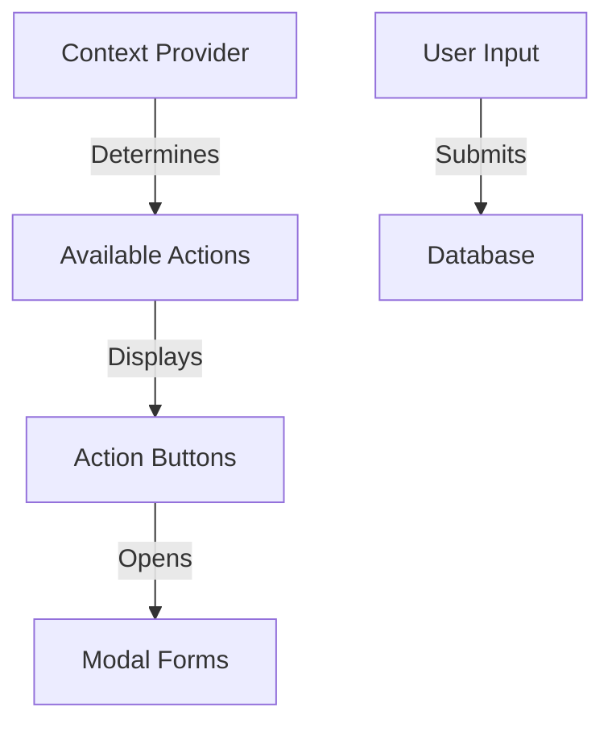
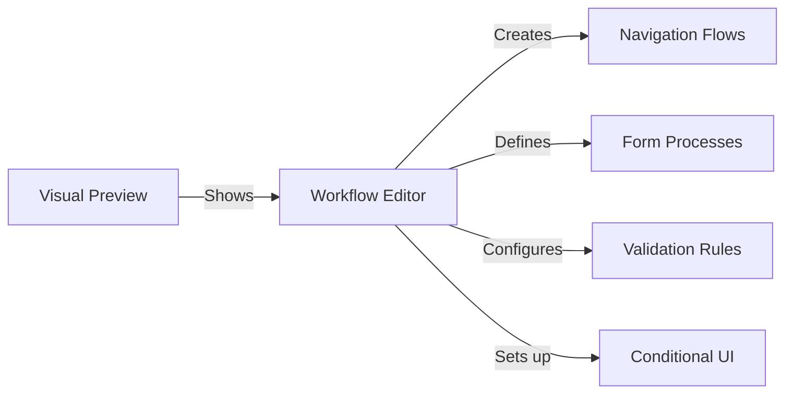
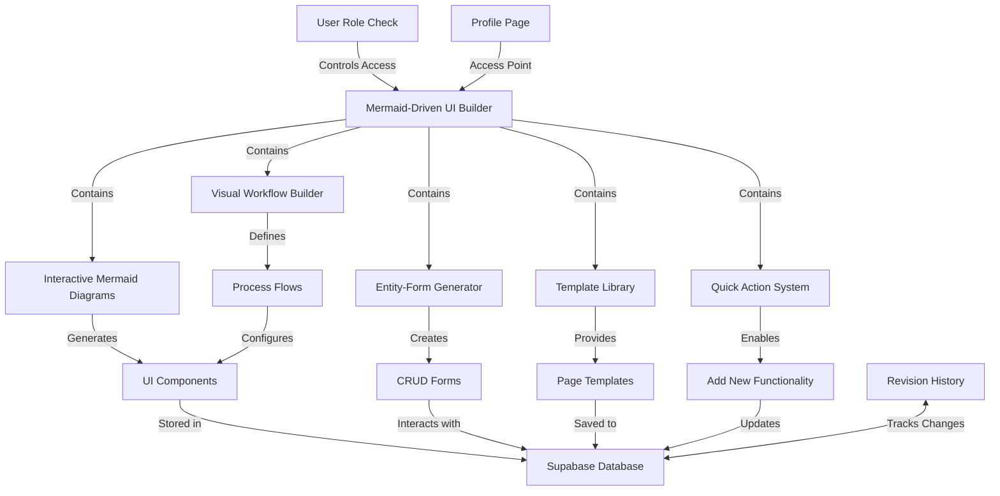

# Mermaid-Driven UI Builder

## Overview

The Mermaid-Driven UI Builder is a visual interface for creating and customizing UI components, pages, and database interactions in the CRM system. It replaces the Puck editor with a more intuitive approach that leverages mermaid diagrams as both visualization and creation tools.

## Access Control

Access to the Mermaid-Driven UI Builder is restricted to developer users only:

- Developer user email: `braden.lang77@gmail.com` (UID: `9600a18c-c8e3-44ef-83ad-99ede9268e77`)
- Access is controlled through user role checks in the database
- The builder is accessible via the "Page Builder" tab in the user's Profile page

## Key Components

The Mermaid-Driven UI Builder consists of five key components:

### 1. Interactive Mermaid Diagrams

The Interactive Mermaid Diagrams component allows developers to:

- Visually design data models and UI components using mermaid syntax
- Click on diagram nodes to edit properties
- Generate actual UI components and forms from the diagrams
- Preview changes in real-time

Implementation uses:

- [mermaid.js](https://mermaid.js.org/) for diagram rendering
- Custom React components for interactive editing
- Two-way binding between diagram code and visual representation



### 2. Entity-Form Generator

The Entity-Form Generator automatically creates CRUD forms based on database schema:

- Analyzes database tables and relationships
- Generates form components with proper validation
- Provides a visual interface to customize these forms
- Integrates with the navigation system's action buttons
- **Supports both visual form building and code integration**

Implementation uses:

- Schema-driven form generation
- Visual form customization interface
- Custom form builders for Supabase integration
- Schema-driven validation rules



#### Visual Form Building

The Entity-Form Generator includes a visual interface where users can:

- Select entity types from a dropdown
- Customize field labels, types, and order
- Hide/show specific fields
- Preview the form as changes are made
- Apply different layouts

This allows non-developers to create and customize forms without writing code.

#### Code Integration

For developers, the components can be imported and used in code:

```tsx
// Import components
import {
  EntityForm,
  CustomerForm,
  EmployeeForm,
  CourseForm
} from './components/MermaidUIBuilder';

// Use generic EntityForm for any entity type
<EntityForm
  entityType="customers"
  entityId={id}
  onSuccess={handleSuccess}
  onCancel={handleCancel}
/>

// Use specialized entity forms
<CustomerForm
  customerId={id}
  onSuccess={handleSuccess}
  onCancel={handleCancel}
/>
```

### 3. Template Library

The Template Library provides pre-built templates for common pages and components:

- Dashboard widgets
- List views
- Detail views
- Form layouts
- Navigation structures

Implementation uses:

- Component categorization system
- Preview thumbnails
- Drag-and-drop application
- Customization options



### 4. Quick Action System

The Quick Action System implements the "Add New" functionality through:

- Floating action buttons in relevant sections
- Context-aware forms that appear in modals or side panels
- Integration with the navigation system's action buttons

Implementation uses:

- Context providers for awareness of current section
- Modal system for form display
- Animation effects for smooth transitions



### 5. Visual Workflow Builder

The Visual Workflow Builder allows defining:

- Page navigation flows
- Form submission processes
- Data validation rules
- Conditional UI rendering

Implementation uses:

- [React Flow](https://reactflow.dev/) for node-based workflow editing
- State machine concepts for workflow definition
- Visual feedback for active states



## Database Integration

Changes made in the Mermaid-Driven UI Builder are saved to the Supabase database:

- UI configurations are stored in the `pages` table
- Revision history is stored in the `page_revisions` table
- Database schema changes are tracked and versioned
- Each page has a unique ID and content JSON
- Changes can be scoped to organization or platform level

## Editing Levels

The Mermaid-Driven UI Builder supports two levels of editing:

1. **Organization Level**: Changes apply only to the current organization
2. **Platform Level**: Changes apply across all organizations (dev users only)

## Safety Measures

To ensure system stability and prevent data loss:

- Changes are validated before being saved to the database
- Revision history is maintained for all changes
- Rollback functionality allows reverting to previous versions
- Database transactions ensure atomic operations
- Preview mode allows testing without publishing

## Technical Architecture



## Dashboard Canvas Alignment (March 2026)

The CRM7 dashboard edit mode is the **first production surface** of this builder. Decisions made there carry forward:

| Dashboard (current) | UI Builder (future) |
|---|---|
| `layoutCols` + `noCompactor` free canvas | Page builder canvas — same model |
| `widgetDefinitions` registry in `Dashboard.tsx` | Template Library component registry |
| `useScopedPreference('page:dashboard_grid_layouts')` | Will be replaced by `pages` + `page_revisions` Supabase tables |
| Edit mode gated to `isDeveloper \|\| can('manage_system')` | Builder access gated to org admin + developer roles |

Do not redesign the dashboard drag/layout system independently — any changes must align with the builder architecture above.

---

## Implementation Plan

The Mermaid-Driven UI Builder will be implemented in phases:

### Phase 1: Entity-Form Generator

- Implement automatic form generation from database schema
- Create "Add New" functionality for all entity types
- Integrate with existing navigation system
- Add validation rules based on schema

### Phase 2: Interactive Mermaid Diagrams

- Implement mermaid.js integration
- Create interactive editing capabilities
- Build diagram-to-UI component generation
- Add real-time preview functionality

### Phase 3: Template Library

- Create component categorization system
- Build template preview functionality
- Implement drag-and-drop application
- Add customization options

### Phase 4: Quick Action System

- Implement context-aware action buttons
- Create modal form system
- Add animation effects
- Integrate with navigation system

### Phase 5: Visual Workflow Builder

- Implement React Flow integration
- Create workflow definition interface
- Build state machine engine
- Add visual feedback for active states

## Usage Guidelines

When using the Mermaid-Driven UI Builder:

1. Access the builder through the "Page Builder" tab in your Profile page
2. Use the Interactive Mermaid Diagrams to design your UI and data models
3. Generate forms automatically with the Entity-Form Generator
4. Apply templates from the Template Library for common patterns
5. Configure Quick Actions for entity creation
6. Define workflows with the Visual Workflow Builder
7. Preview changes before publishing
8. Use revision history to track changes and revert if needed
9. Select the appropriate scope (organization or platform) for your changes
