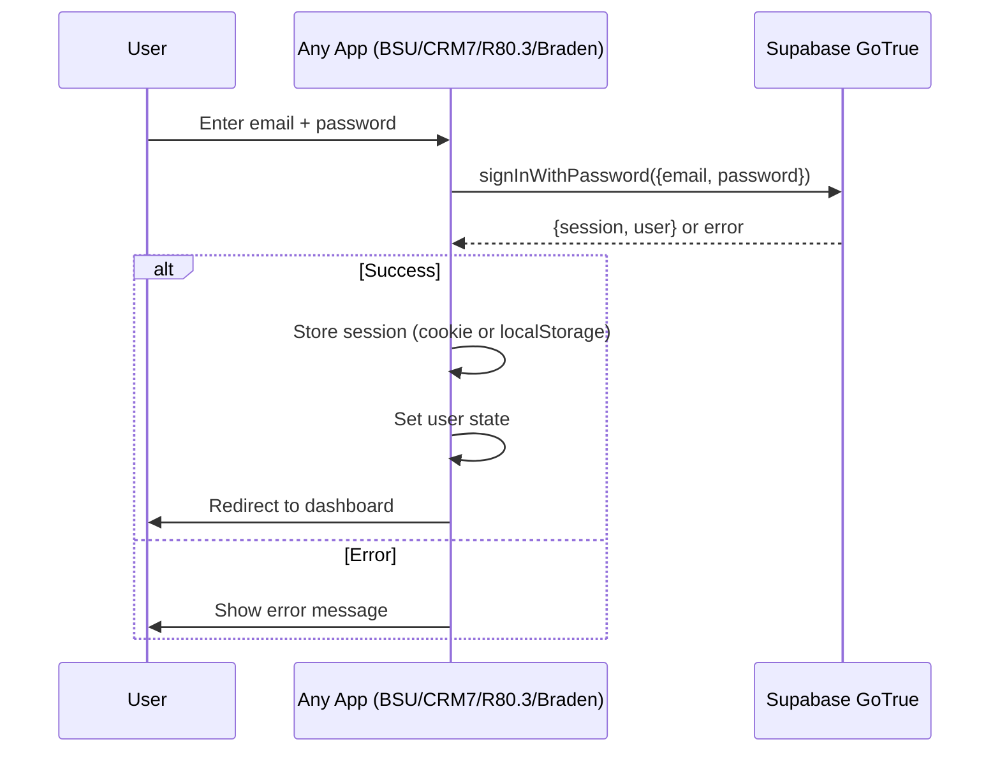
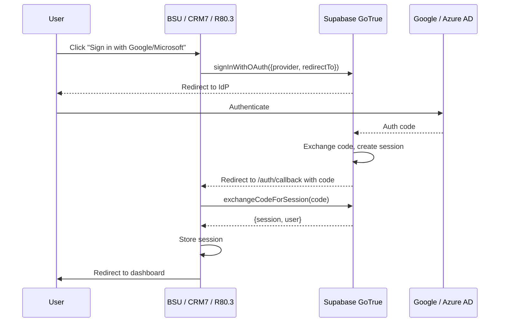
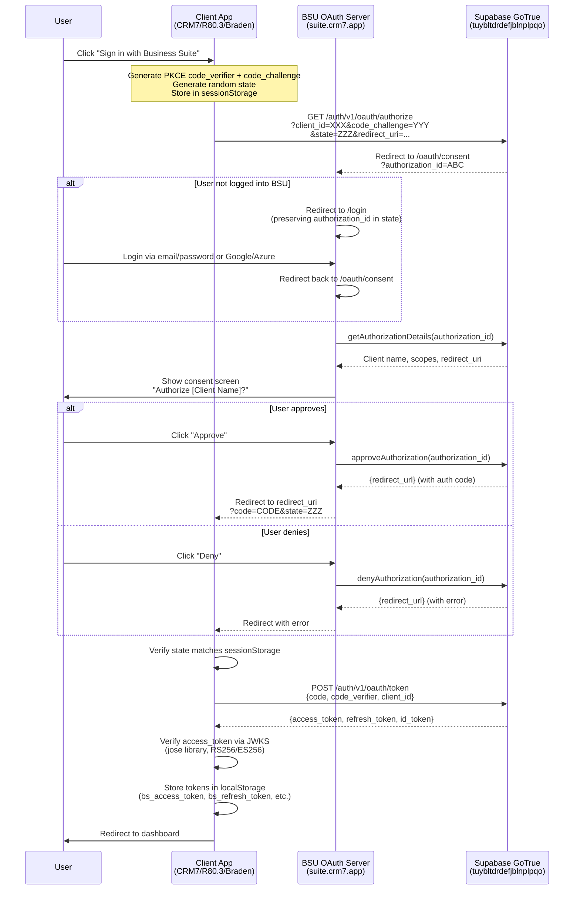
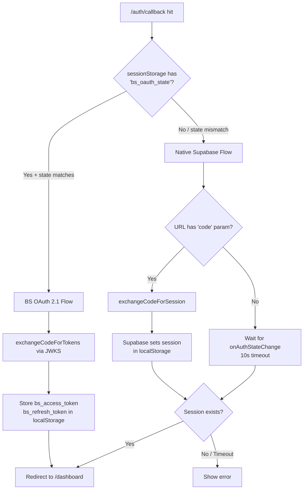

# Auth Map — Business Suite Ecosystem

> **Generated**: 25 Feb 2026 · **Fixes Applied**: 25 Feb 2026 · **Cookie Hardening**: 25 Feb 2026  
> **Scope**: BSU · CRM7 · R80.3 · Braden  
> **Supabase Project**: `tuybltdrdefjblnplpqo`

---

## Table of Contents

1. [Architecture Overview](#1-architecture-overview)
2. [Per-App Auth Inventory](#2-per-app-auth-inventory)
3. [Auth Flow Diagrams (Mermaid)](#3-auth-flow-diagrams)
4. [Token Storage Map](#4-token-storage-map)
5. [OAuth Client Registry](#5-oauth-client-registry)
6. [Domain & Redirect URI Map](#6-domain--redirect-uri-map)
7. [Dead Code Inventory](#7-dead-code-inventory)
8. [Cookie / Cross-Subdomain Analysis](#8-cookie--cross-subdomain-analysis)
9. [Dual Auth Conflict Analysis](#9-dual-auth-conflict-analysis)
10. [Recommendations](#10-recommendations)

---

## 1. Architecture Overview

The ecosystem uses **two distinct auth mechanisms** that coexist:

| Mechanism | Description | Identity Provider | Used By |
|-----------|-------------|-------------------|---------|
| **Supabase Native Auth** | Email/password + OAuth (Google/Azure AD) via Supabase GoTrue | Supabase `tuybltdrdefjblnplpqo` | All 4 apps |
| **BS OAuth 2.1 PKCE** | Custom OAuth Authorization Code flow with PKCE. BSU acts as the OAuth server via Supabase's OAuth Server feature. Client apps redirect to BSU consent screen. | BSU (via Supabase OAuth Server) | CRM7, R80.3, Braden (as clients) |

**Key distinction**: Supabase Native Auth creates a Supabase session directly in each app. BS OAuth 2.1 creates a *separate* token set (`bs_access_token` etc.) stored in localStorage — these are **not** Supabase sessions. The two systems run in parallel and do not share state.

```
┌─────────────────────────────────────────────────────────────────┐
│                    Supabase Project                              │
│                tuybltdrdefjblnplpqo                              │
│                                                                  │
│  ┌──────────────┐  ┌──────────────┐  ┌───────────────────────┐  │
│  │  GoTrue Auth │  │  OAuth Server│  │  JWKS Endpoint        │  │
│  │  (Native)    │  │  (BS OAuth)  │  │  /.well-known/jwks    │  │
│  └──────┬───────┘  └──────┬───────┘  └───────────┬───────────┘  │
│         │                  │                      │              │
└─────────┼──────────────────┼──────────────────────┼──────────────┘
          │                  │                      │
    ┌─────┴─────┐    ┌──────┴──────┐         ┌─────┴─────┐
    │  BSU      │    │  CRM7       │         │  jose     │
    │  R80.3    │    │  R80.3      │         │  library  │
    │  CRM7     │    │  Braden     │         │  (verify) │
    │  Braden   │    └─────────────┘         └───────────┘
    └───────────┘
```

---

## 2. Per-App Auth Inventory

### 2.1 Business Suite Unified (BSU)

**Role**: Identity Provider (OAuth Server) + Standard Supabase Auth consumer  
**Domain**: `suite.crm7.app`

| File | Purpose | Auth Type |
|------|---------|-----------|
| `src/lib/supabase.ts` | Supabase client with **cookieStorage** (`domain=.crm7.app`), storageKey `business_suite_auth`, PKCE flow | Native + Cookie |
| `src/contexts/AuthContext.tsx` | Auth context: `signIn`, `signUp`, `signInWithOAuth` (Google/Azure), `signOut`. Loads `tenantId` from `user_tenants` table | Native |
| `src/components/AuthForm.tsx` | Login UI: Google + Microsoft (Azure AD) OAuth buttons, email/password | Native |
| `src/pages/auth/AuthCallback.tsx` | PKCE code exchange (`exchangeCodeForSession`), hash token detection (implicit/magic links). Redirects to `/` | Native |
| `src/pages/oauth/OAuthConsent.tsx` | **OAuth Server consent screen**. Uses `supabase.auth.oauth.getAuthorizationDetails/approveAuthorization/denyAuthorization`. Shows client name, scopes, approve/deny buttons | OAuth Server |
| `src/components/AppContent.tsx` | Routes: `/login` → AuthScreen, `/auth/callback` → AuthCallback, `/oauth/consent` → OAuthConsent, `/*` → protected MainApp | Router |

**Token storage**: Cookies via `cookieStorage` with `domain=.crm7.app`  
**Storage key**: `business_suite_auth`

---

### 2.2 CRM7

**Role**: OAuth Client (to BSU) + Standard Supabase Auth consumer  
**Domain**: `crm.crm7.app`

| File | Purpose | Auth Type |
|------|---------|-----------|
| `src/lib/supabase.ts` | Supabase client with **cookieStorage** (`domain=.crm7.app`), storageKey `business_suite_auth`, PKCE flow ✅ **FIXED 25 Feb 2026** | Native + Cookie |
| `src/contexts/AuthContext.tsx` | Auth context: `signIn`, `signUp`, `signInWithOAuth` (Google), `resetPassword`, `updatePassword`, `signOut` | Native |
| `src/lib/business-suite-oauth.ts` | BS OAuth 2.1 PKCE client. Client ID: `30f76744-3e0b-40bf-abb8-8c587389802e`. JWKS verification via `jose` | BS OAuth |
| `src/pages/auth/business-suite-sso.tsx` | Initiates BS OAuth flow → redirects to BSU consent screen | BS OAuth |
| `src/pages/auth/callback.tsx` | **Dual callback handler**: Checks `sessionStorage` for `bs_oauth_state` to distinguish BS OAuth from native Supabase PKCE. Handles both flows at `/auth/callback` | Both |
| `src/pages/auth/reset-password.tsx` | Password reset via PKCE code exchange | Native |
| `src/pages/auth/login.tsx` | Login page ✅ **Stale authToken removed 25 Feb 2026** | Native |
| `src/components/LoginModal.tsx` | Login with Google OAuth, email/password | Native |
| `src/components/SignupModal.tsx` | Signup with Google OAuth | Native |
| `src/components/auth/protected-route.tsx` | Route guard checking auth state | Native |

**Token storage**: 
- Native Supabase: Cookies via `cookieStorage` with `domain=.crm7.app` (key: `business_suite_auth`) ✅ **FIXED 25 Feb 2026**  
- BS OAuth: localStorage (`bs_access_token`, `bs_refresh_token`, `bs_user`, `bs_id_token`)

---

### 2.3 R80.3

**Role**: OAuth Client (to BSU) + Standard Supabase Auth consumer  
**Domain**: `r8.crm7.app`

| File | Purpose | Auth Type |
|------|---------|-----------|
| `src/services/supabaseClient.ts` | Supabase client with **cookieStorage** (`domain=.crm7.app`), storageKey `business_suite_auth` ✅ **FIXED 25 Feb 2026**. Includes CRUD helpers | Native + Cookie |
| `src/stores/authStore.ts` | Zustand auth store (canonical): `signIn`, `signUp`, `signOut`, `resetPassword` + `tenantId` from `user_tenants`. Selector hooks ✅ **AuthLite.tsx removed 25 Feb 2026** | Native |
| `src/lib/business-suite-oauth.ts` | BS OAuth 2.1 PKCE client. Client ID: `5d804d20-cd1b-4724-9107-86d2a9e51e09`. JWKS verification via `jose` | BS OAuth |
| `src/pages/AuthCallback.tsx` | BS OAuth callback only — exchanges code for tokens, stores in localStorage, redirects to `/` | BS OAuth |
| `src/components/LoginModal.tsx` | Login with Google OAuth (`signInWithOAuth`), email/password, signup | Native |
| `src/components/SettingsPage.tsx` | User settings, sign out | Native |

**Token storage**:  
- Native Supabase: Cookies via `cookieStorage` with `domain=.crm7.app` (key: `business_suite_auth`) ✅ **FIXED 25 Feb 2026**  
- BS OAuth: localStorage (`bs_access_token`, `bs_refresh_token`, `bs_user`, `bs_id_token`)

---

### 2.4 Braden

**Role**: OAuth Client (to BSU) + Standard Supabase Auth consumer  
**Domain**: `www.braden.com.au`

| File | Purpose | Auth Type |
|------|---------|-----------|
| `src/integrations/supabase/client.ts` | Supabase client — **NO** cookieStorage, NO cross-domain. Default localStorage. Supports both `VITE_*` and `NEXT_PUBLIC_*` env vars | Native (localStorage) |
| `src/hooks/useAdminAuth.ts` | Admin auth: `signInWithPassword`, `RoleManager` role checks (developer/admin). Redirects to `/admin` | Native |
| `src/hooks/useAuth.ts` | Generic auth hook: `getUser()` + `onAuthStateChange` listener | Native |
| `src/lib/business-suite-oauth.ts` | BS OAuth 2.1 PKCE client. Client ID: `dcb7af18-254a-4946-b94d-5c606b01fc3f`. JWKS verification via `jose` | BS OAuth |
| `src/pages/auth/AuthCallback.tsx` | BS OAuth callback **only** — exchanges code, stores in localStorage, redirects to `/admin/dashboard` | BS OAuth |
| `src/pages/auth/AdminAuth.tsx` | Admin login page, sign out | Native |
| ~~`src/pages/oauth/OAuthConsent.tsx`~~ | ✅ **DELETED 25 Feb 2026** — Was dead OAuth server consent page on client app | ~~OAuth Server~~ |
| `src/components/auth/AdminLoginForm.tsx` | Admin login form UI | Native |
| `src/components/auth/AuthLoadingState.tsx` | Loading spinner during auth checks | UI |

**Token storage**:  
- Native Supabase: localStorage (default)  
- BS OAuth: localStorage (`bs_access_token`, `bs_refresh_token`, `bs_user`, `bs_id_token`)

---

## 3. Auth Flow Diagrams

### 3.1 Native Supabase Auth (Email/Password)



### 3.2 Native Supabase OAuth (Google/Azure AD)



### 3.3 Business Suite OAuth 2.1 (PKCE) — SSO Flow



### 3.4 CRM7 Dual Callback Resolution



### 3.5 Complete Ecosystem Auth Map

```mermaid
graph TB
    subgraph "Supabase Project: tuybltdrdefjblnplpqo"
        GT[GoTrue Auth Engine]
        OAS[OAuth Server]
        JWKS[JWKS Endpoint]
    end
    
    subgraph "BSU — suite.crm7.app"
        BSU_AUTH[AuthContext<br/>email/password + Google/Azure]
        BSU_CONSENT[OAuthConsent<br/>Server-side consent screen]
        BSU_CALLBACK[AuthCallback<br/>PKCE code exchange]
        BSU_COOKIE[(Cookie Storage<br/>domain=.crm7.app<br/>key: business_suite_auth)]
    end
    
    subgraph "CRM7 — crm.crm7.app"
        CRM_AUTH[AuthContext<br/>email/password + Google]
        CRM_SSO[BusinessSuiteSSO<br/>Initiates BS OAuth]
        CRM_CALLBACK[callback.tsx<br/>Dual: BS OAuth + Native]
        CRM_COOKIE[(Cookie Storage ✅<br/>domain=.crm7.app<br/>key: business_suite_auth)]
        CRM_LS[(localStorage<br/>bs_access_token)]
    end
    
    subgraph "R80.3 — r8.crm7.app"
        R8_AUTH_STORE[authStore Zustand ✅]
        R8_SSO[business-suite-oauth.ts<br/>BS OAuth client]
        R8_CALLBACK[AuthCallback<br/>BS OAuth only]
        R8_COOKIE[(Cookie Storage ✅<br/>domain=.crm7.app<br/>key: business_suite_auth)]
        R8_LS[(localStorage<br/>bs_access_token)]
    end
    
    subgraph "Braden — www.braden.com.au"
        BR_ADMIN[useAdminAuth<br/>signInWithPassword + roles]
        BR_AUTH[useAuth<br/>getUser + listener]
        BR_SSO[business-suite-oauth.ts<br/>BS OAuth client]
        BR_CALLBACK[AuthCallback<br/>BS OAuth only]
        BR_LS[(localStorage<br/>Supabase default +<br/>bs_access_token)]
    end
    
    %% Native auth flows
    BSU_AUTH --> GT
    CRM_AUTH --> GT
    R8_AUTH_STORE --> GT
    BR_ADMIN --> GT
    
    %% BS OAuth flows
    CRM_SSO -->|authorize| OAS
    R8_SSO -->|authorize| OAS
    BR_SSO -->|authorize| OAS
    OAS -->|consent redirect| BSU_CONSENT
    BSU_CONSENT -->|approve/deny| OAS
    OAS -->|code redirect| CRM_CALLBACK
    OAS -->|code redirect| R8_CALLBACK
    OAS -->|code redirect| BR_CALLBACK
    
    %% JWKS verification
    CRM_CALLBACK -.->|verify token| JWKS
    R8_CALLBACK -.->|verify token| JWKS
    BR_CALLBACK -.->|verify token| JWKS
    
    %% Storage
    BSU_AUTH --> BSU_COOKIE
    CRM_AUTH --> CRM_COOKIE
    R8_AUTH_STORE --> R8_COOKIE
    BR_ADMIN --> BR_LS
```



---

## 4. Token Storage Map

| App | Auth Type | Storage Mechanism | Key(s) | Cross-Domain? |
|-----|-----------|-------------------|--------|---------------|
| **BSU** | Native Supabase | Cookie (`cookieStorage`) | `business_suite_auth` | ✅ `domain=.crm7.app` |
| **CRM7** | Native Supabase | Cookie (`cookieStorage`) ✅ | `business_suite_auth` | ✅ `domain=.crm7.app` |
| **CRM7** | BS OAuth | localStorage | `bs_access_token`, `bs_refresh_token`, `bs_user`, `bs_id_token` | ❌ |
| **R80.3** | Native Supabase | Cookie (`cookieStorage`) ✅ | `business_suite_auth` | ✅ `domain=.crm7.app` |
| **R80.3** | BS OAuth | localStorage | `bs_access_token`, `bs_refresh_token`, `bs_user`, `bs_id_token` | ❌ |
| **Braden** | Native Supabase | localStorage (default) | `sb-<ref>-auth-token` | ❌ (different domain) |
| **Braden** | BS OAuth | localStorage | `bs_access_token`, `bs_refresh_token`, `bs_user`, `bs_id_token` | ❌ |

**Cross-domain session sharing status (post-fix)**:
- BSU → CRM7: ✅ **Both now use `cookieStorage` with key `business_suite_auth` on `domain=.crm7.app`** — sessions shared!
- BSU → R80.3: ✅ **Both now use `cookieStorage` with key `business_suite_auth` on `domain=.crm7.app`** — sessions shared!
- BSU → Braden: ❌ Different TLD (`braden.com.au` vs `crm7.app`). Impossible via cookies. Uses BS OAuth instead.

---

## 5. OAuth Client Registry

| Client App | Client ID | Redirect URI |
|------------|-----------|--------------|
| **CRM7** | `30f76744-3e0b-40bf-abb8-8c587389802e` | `{origin}/auth/callback` |
| **R80.3** | `5d804d20-cd1b-4724-9107-86d2a9e51e09` | `{origin}/auth/callback` |
| **Braden** | `dcb7af18-254a-4946-b94d-5c606b01fc3f` | `{origin}/auth/callback` |

All three clients use the same Supabase project as the authorization server: `tuybltdrdefjblnplpqo`.

---

## 6. Domain & Redirect URI Map

| App | Production Domain | Auth Callback URL | OAuth Consent URL |
|-----|-------------------|-------------------|-------------------|
| **BSU** | `suite.crm7.app` | `suite.crm7.app/auth/callback` | `suite.crm7.app/oauth/consent` (SERVER) |
| **CRM7** | `crm.crm7.app` | `crm.crm7.app/auth/callback` | N/A |
| **R80.3** | `r8.crm7.app` | `r8.crm7.app/auth/callback` | N/A |
| **Braden** | `www.braden.com.au` | `www.braden.com.au/auth/callback` | ~~N/A~~ ✅ Deleted |

---

## 7. Dead Code Inventory

### 🔴 CRITICAL — ~~Causes Confusion or Breaks Functionality~~ ALL FIXED ✅

| # | App | File | Issue | Status |
|---|-----|------|-------|--------|
| 1 | **CRM7** | `src/lib/supabase.ts` | `cookieStorage` was defined but never passed to `createClient()` | ✅ **FIXED** — Wired `cookieStorage` + `storageKey: 'business_suite_auth'` into createClient |
| 2 | **Braden** | `src/pages/oauth/OAuthConsent.tsx` | OAuth **server** consent page on a **client** app (243 lines dead weight) | ✅ **FIXED** — File and `oauth/` directory deleted |
| 3 | **R80.3** | `src/context/AuthLite.tsx` | Duplicate auth state manager alongside `authStore.ts` (Zustand) | ✅ **FIXED** — `AuthLite.tsx` deleted, `CalculatorContext.tsx` updated to use `authStore` |

### 🟡 WARNING — Exported But Never Called

| # | App | File | Function | Notes |
|---|-----|------|----------|-------|
| 4 | **Braden** | `src/lib/business-suite-oauth.ts` | `getUserInfo()` | Exported, no callers found in Braden codebase |
| 5 | **Braden** | `src/lib/business-suite-oauth.ts` | `refreshBusinessSuiteToken()` | Exported, no callers found. BS tokens will expire without refresh |
| 6 | **CRM7** | `src/lib/business-suite-oauth.ts` | `getUserInfo()` | Exported, no callers found in CRM7 codebase |
| 7 | **CRM7** | `src/lib/business-suite-oauth.ts` | `refreshBusinessSuiteToken()` | Exported, no callers found. BS tokens will expire without refresh |
| 8 | **R80.3** | `src/lib/business-suite-oauth.ts` | `getUserInfo()` | Exported, no callers found in R80.3 codebase |
| 9 | **R80.3** | `src/lib/business-suite-oauth.ts` | `refreshBusinessSuiteToken()` | Exported, no callers found. BS tokens will expire without refresh |

### 🟢 LOW — Minor / Cosmetic

| # | App | File | Issue | Status |
|---|-----|------|-------|--------|
| 10 | **CRM7** | `src/pages/auth/login.tsx` | `localStorage.setItem('authToken', token)` — stale key nothing reads | ✅ **FIXED** — Line removed |
| 11 | **R80.3** | `src/services/supabaseClient.ts` lines 60-230+ | Contains CRUD helpers mixed with Supabase client creation. 230+ lines | ⏳ Deferred (P2) |

---

## 8. Cookie / Cross-Subdomain Analysis

### How It's Supposed to Work

BSU stores the Supabase session in a cookie with `domain=.crm7.app`. Any subdomain (`crm.crm7.app`, `r8.crm7.app`) should be able to read this cookie and share the session — enabling seamless SSO across the suite.

### What Actually Happens (Post-Fix ✅)

| App | Cookie Storage | Storage Key | Can Read BSU Cookie? |
|-----|---------------|-------------|---------------------|
| **BSU** | ✅ Active (`cookieStorage`) | `business_suite_auth` | ✅ Sets it |
| **CRM7** | ✅ Active (`cookieStorage`) **FIXED** | `business_suite_auth` | ✅ **Shares session with BSU** |
| **R80.3** | ✅ Active (`cookieStorage`) **FIXED** | `business_suite_auth` | ✅ **Shares session with BSU** |
| **Braden** | ❌ Not applicable | N/A | ❌ Different domain (uses BS OAuth instead) |

**Result**: Cross-subdomain cookie SSO is now **working** for the `.crm7.app` subdomains:
- ✅ BSU, CRM7, and R80.3 all use `cookieStorage` with `domain=.crm7.app` and key `business_suite_auth`
- ❌ Braden on `braden.com.au` cannot share cookies (expected — uses BS OAuth 2.1 for SSO instead)

### Cookie Hardening — 25 Feb 2026

Red-team validation identified 4 critical issues with the original `cookieStorage`. All fixed:

| Issue | Before | After |
|-------|--------|-------|
| **Cookie size limit** | Single cookie per session — fails silently when Supabase session JSON exceeds 4 096 bytes (RFC 6265) after `encodeURIComponent()` | **Chunked storage**: Values >3 500 bytes are split across `key.0`, `key.1`, … cookies and reassembled on read (similar to `@supabase/ssr`) |
| **`Secure` flag on localhost** | Always set `Secure` — cookies invisible over HTTP during development | `Secure` only added when `location.protocol === 'https:'` |
| **`removeItem` attribute mismatch** | `removeItem` omitted `SameSite=Lax; Secure` — browser might not match the correct cookie for deletion | `deleteAttrs()` mirrors `cookieAttrs()` with `max-age=0` instead of expiry date |
| **Excessive max-age** | `max-age=31536000` (1 year) — auth tokens outlive session validity | `max-age=2592000` (30 days) — aligned with typical Supabase refresh token lifetime |

**Implementation**: Identical `cookieStorage` in all 3 files:
- `business-suite-unified/src/lib/supabase.ts`
- `crm7/src/lib/supabase.ts`
- `R80.3/src/services/supabaseClient.ts`

---

## 9. Dual Auth Conflict Analysis

### CRM7: Two Login Paths, One Callback

CRM7 users can authenticate via:
1. **Native Supabase** (LoginModal → Google OAuth or email/password) → redirects to `/auth/callback`
2. **BS OAuth** (business-suite-sso → BSU consent) → also redirects to `/auth/callback`

The callback page (`crm7/src/pages/auth/callback.tsx`) **correctly distinguishes** between the two by checking `sessionStorage.getItem('bs_oauth_state')`:
- If `bs_oauth_state` exists and matches → BS OAuth flow
- Otherwise → Native Supabase PKCE flow

**Verdict**: ✅ Well-implemented. No conflict.

### R80.3: ~~Two Auth State Managers~~ Consolidated ✅

R80.3 previously had two parallel auth managers (`AuthLite.tsx` + `authStore.ts`). **Fixed 25 Feb 2026**: `AuthLite.tsx` deleted, `CalculatorContext.tsx` updated to use `useAuthStore` from the Zustand store. Single canonical auth source now.

**Verdict**: ✅ Fixed. `authStore.ts` is the sole auth state manager.

### Braden: Admin Auth vs BS OAuth

Braden has two distinct login mechanisms:
1. **`useAdminAuth`** — Supabase `signInWithPassword` + role checking via `RoleManager`. Used by admin pages.
2. **BS OAuth** — Custom OAuth flow to BSU. Stores BS tokens separately in localStorage.

These serve **different purposes** (admin access vs SSO) but share no state. A user could theoretically have both a Supabase session AND BS OAuth tokens simultaneously, with no code reconciling them.

**Verdict**: ⚠️ Intentional but fragile. Needs clear documentation on which auth path gates which features.

---

## 10. Recommendations

### Immediate (Fix Dead Code / Bugs) — ✅ ALL COMPLETED 25 Feb 2026

| Priority | Action | App | Status |
|----------|--------|-----|--------|
| 🔴 P0 | Wire `cookieStorage` into CRM7's `createClient()` with `storageKey: 'business_suite_auth'` | CRM7 | ✅ Done |
| 🔴 P0 | Delete `OAuthConsent.tsx` from Braden (server page on client app) | Braden | ✅ Done |
| 🔴 P0 | Consolidate R80.3 to single auth manager (keep `authStore.ts`, remove `AuthLite.tsx`) | R80.3 | ✅ Done |
| 🟡 P1 | Align cookie storage key to `business_suite_auth` (was `sb-auth-token`) | R80.3 | ✅ Done |
| 🟡 P1 | Remove stale `authToken` localStorage set | CRM7 | ✅ Done |

### Medium Term (Architecture Cleanup)

| Priority | Action | Details |
|----------|--------|---------|
| 🟡 P1 | **Implement BS token refresh** across all client apps. Currently `refreshBusinessSuiteToken()` exists but is never called — BS OAuth tokens will silently expire | Add refresh logic to a global auth effect or interceptor |
| ~~🟡 P1~~ | ~~Decide on cookie vs localStorage for CRM7~~ | ✅ **Resolved** — wired in `cookieStorage` with `business_suite_auth` |
| 🟡 P2 | **Remove `getUserInfo()` from all BS OAuth clients** or wire it into user profile hydration | Currently exported but never used in any app |
| 🟡 P2 | **Extract `supabaseClient.ts` CRUD helpers in R80.3** into separate service files — the 230+ line file mixes auth client creation with data access | R80.3 code organization |

### Long Term (Architecture Evolution)

| Priority | Action | Details |
|----------|--------|---------|
| 🟢 P3 | **Unify BS OAuth client into a shared package** — all three client apps (`business-suite-oauth.ts`) are near-identical. Only the `CLIENT_ID` differs | Monorepo shared package |
| 🟢 P3 | **Bridge BS OAuth tokens with Supabase session** — currently a user can have a BS OAuth token but no Supabase session (or vice versa). Consider using BS OAuth for session establishment | Requires architectural design |
| 🟢 P3 | **Add PKCE replay protection** — `sessionStorage` PKCE values survive tab restores. Consider adding timestamp/nonce to prevent stale code exchange attempts | Security hardening |

---

## Appendix: File Reference Index (Post-Fix)

```
bsuite/
├── business-suite-unified/
│   ├── src/lib/supabase.ts                      # Supabase client + cookieStorage ✅ (key: business_suite_auth)
│   ├── src/contexts/AuthContext.tsx              # Auth context (Native)
│   ├── src/components/AuthForm.tsx               # Login UI
│   ├── src/components/AppContent.tsx             # Route definitions
│   ├── src/pages/auth/AuthCallback.tsx           # Native PKCE callback
│   └── src/pages/oauth/OAuthConsent.tsx          # OAuth SERVER consent ✅
│
├── crm7/
│   ├── src/lib/supabase.ts                      # ✅ cookieStorage wired in (key: business_suite_auth)
│   ├── src/lib/business-suite-oauth.ts          # BS OAuth client
│   ├── src/contexts/AuthContext.tsx              # Auth context (Native)
│   ├── src/pages/auth/callback.tsx              # Dual callback handler ✅
│   ├── src/pages/auth/business-suite-sso.tsx    # BS OAuth initiator
│   ├── src/pages/auth/login.tsx                 # ✅ Stale authToken removed
│   ├── src/pages/auth/reset-password.tsx        # Password reset
│   ├── src/components/LoginModal.tsx            # Login modal
│   ├── src/components/SignupModal.tsx            # Signup modal
│   └── src/components/auth/protected-route.tsx  # Route guard
│
├── R80.3/
│   ├── src/services/supabaseClient.ts           # ✅ cookieStorage (key: business_suite_auth) — aligned with BSU
│   ├── src/lib/business-suite-oauth.ts          # BS OAuth client
│   ├── src/stores/authStore.ts                  # ✅ Sole auth store (AuthLite.tsx deleted)
│   ├── src/pages/AuthCallback.tsx               # BS OAuth callback
│   ├── src/components/LoginModal.tsx            # Login modal
│   └── src/components/SettingsPage.tsx          # Settings + signout
│
└── braden/
    ├── src/integrations/supabase/client.ts      # Supabase client (no cookies — different domain)
    ├── src/lib/business-suite-oauth.ts          # BS OAuth client
    ├── src/hooks/useAdminAuth.ts                # Admin auth hook
    ├── src/hooks/useAuth.ts                     # Generic auth hook
    ├── src/pages/auth/AuthCallback.tsx          # BS OAuth callback
    ├── src/pages/auth/AdminAuth.tsx             # Admin login page
    ├── src/components/auth/AdminLoginForm.tsx   # Admin login form
    └── src/components/auth/AuthLoadingState.tsx # ✅ OAuthConsent.tsx deleted
```
