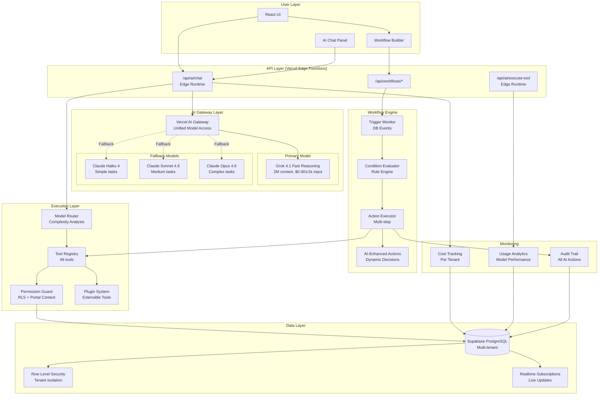
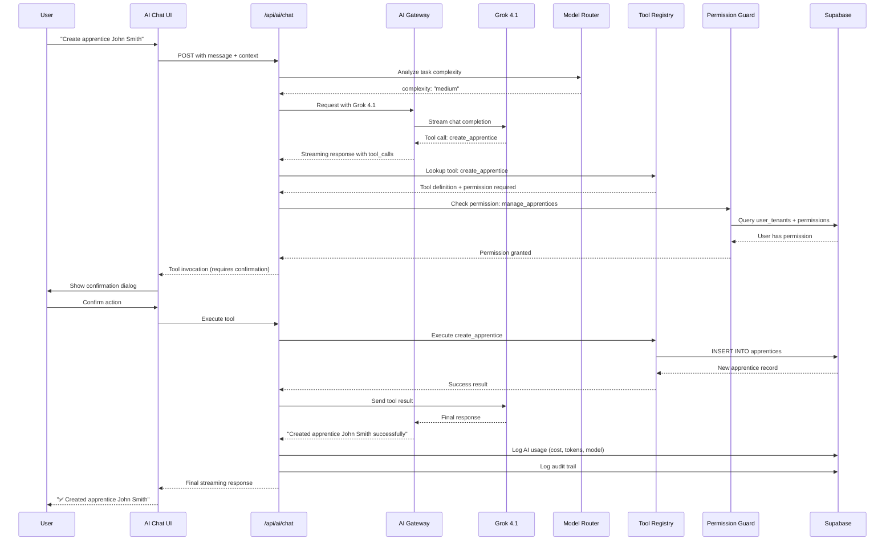
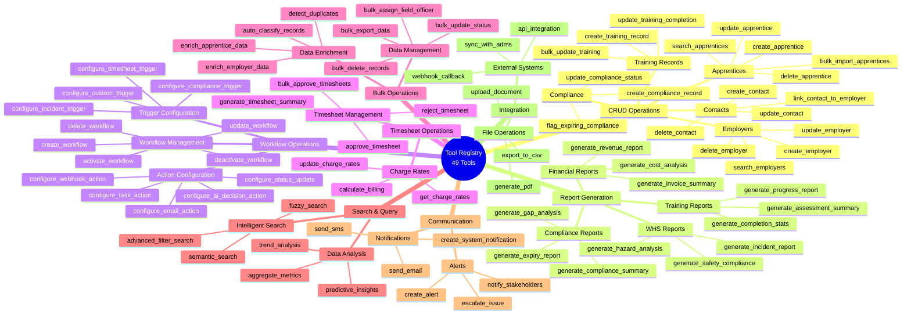
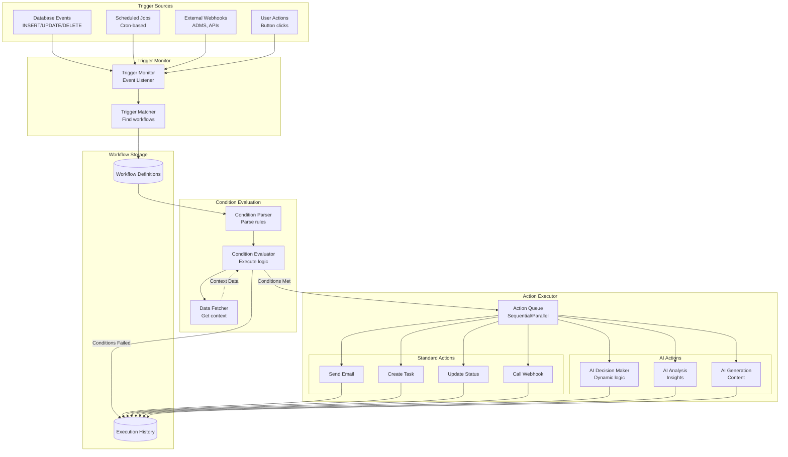
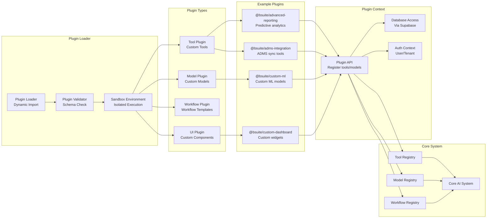

# Complete AI Feature Map

**Version:** 1.00W
**Date:** 2026-02-27
**Status:** Working (W)

> **Marker correction, 2026-08-17.** This read **Version 1.0.0 / Status: Final** against a `v1.00W`
> filename — two contradictions in three lines. `Final` is not a status in the estate's convention
> (`W`orking / `D`raft / `R`eview / `A`pproved / `F`rozen), and the version used a three-part
> semver that the convention does not use.
>
> `Working` is also the *truthful* status, which is why the filename won rather than the body: this
> map is **not** final. The AI surface it describes has moved since 2026-02-27 — the model roster was
> replaced on 2026-07-31 and `docs/ai/CONTRIBUTING.md` was corrected on 2026-08-17 for naming two
> models that no longer exist. Treat this map as a working inventory and verify any feature against
> `crm7/src/lib/ai/` before relying on it.
**Author:** Development Team
**Supersedes:** N/A

---

## Overview

This document provides a comprehensive map of all AI assistant features in bsuite CRM7, including system architecture, tool registry, workflow automation, and plugin system. All diagrams are in Mermaid format for easy maintenance and version control.

---

## 1. System Architecture Overview

Complete end-to-end architecture from user interface through to database:

**Key Components:**

| Component | Purpose | Technology |
|-----------|---------|------------|
| **AI Chat Panel** | User interface for natural language interaction | React + Shadcn UI |
| **Edge API** | Serverless functions for AI processing | Vercel Edge Runtime |
| **AI Gateway** | Unified model access with fallbacks | Vercel AI Gateway |
| **Grok 4.1** | Primary AI model (2M context, cheap) | xAI via Gateway |
| **Tool Registry** | 80+ executable actions | TypeScript + Zod |
| **Permission Guard** | Multi-tenant security | Supabase RLS |
| **Workflow Engine** | Automated multi-step processes | Custom engine |
| **Plugin System** | Extensible architecture | Dynamic imports |

---

## 2. Tool Execution Flow

Detailed sequence diagram showing complete user interaction through tool execution:

**Execution Steps:**

1. **User Input** → User types natural language request
2. **Complexity Analysis** → Router determines appropriate model
3. **AI Processing** → Model streams response with tool calls
4. **Permission Check** → Verify user can execute action
5. **User Confirmation** → Prompt for destructive actions
6. **Tool Execution** → Execute action on database
7. **Result Streaming** → Stream final response to user
8. **Logging** → Track cost, usage, and audit trail

---

## 3. Complete Tool Registry (49 Tools)

Comprehensive mind map of all available AI tools organized by category:

**Tool Categories Summary:**

| Category | Tool Count | Example Use Cases |
|----------|-----------|-------------------|
| **CRUD Operations** | 20+ | Create apprentice, update employer, delete contact |
| **Report Generation** | 15+ | Compliance reports, financial analysis, training progress |
| **Workflow Operations** | 15+ | Create workflows, configure triggers, set up actions |
| **Timesheet Operations** | 8+ | Approve timesheets, calculate billing, charge rates |
| **Bulk Operations** | 10+ | Bulk updates, data import/export, deduplication |
| **Search & Query** | 8+ | Semantic search, advanced filters, predictive insights |
| **Communication** | 8+ | Emails, SMS, notifications, alerts |
| **Integration** | 6+ | External system sync, webhooks, file operations |

**Total: 49 tools across 8 categories**

---

## 4. Workflow Automation Architecture

Complete workflow automation system from triggers through execution:

**Workflow Components:**

| Component | Purpose | Example |
|-----------|---------|---------|
| **Database Events** | React to data changes | New apprentice created |
| **Scheduled Jobs** | Time-based triggers | Weekly compliance check |
| **External Webhooks** | Integration events | ADMS qualification update |
| **Condition Evaluator** | Rule-based filtering | Only if incident is severe |
| **Standard Actions** | Predefined operations | Send email, create task |
| **AI Actions** | Dynamic AI-powered decisions | Decide escalation path |

**Example Workflows:**

1. **Incident Response**
   - Trigger: WHS incident created
   - Condition: Severity > 3
   - Actions: Notify manager, create investigation task, log in system

2. **Compliance Monitoring**
   - Trigger: Daily at 6 AM
   - Condition: Certificates expiring in < 30 days
   - Actions: Generate report, email stakeholders, flag records

3. **Apprentice Milestone**
   - Trigger: Training completion updated
   - Condition: All modules complete
   - Actions: Update ADMS, create invoice in Xero, send congratulations email

---

## 5. Plugin System Architecture

Extensible plugin system for custom tools, models, and workflows:

**Plugin Types:**

| Plugin Type | Purpose | Example |
|-------------|---------|---------|
| **Tool Plugin** | Add custom AI tools | ADMS integration, custom reports |
| **Model Plugin** | Add custom AI models | Fine-tuned models, specialized LLMs |
| **Workflow Plugin** | Add workflow templates | Industry-specific workflows |
| **UI Plugin** | Add UI components | Custom dashboards, visualizations |

**Example Plugins:**

1. **@bsuite/advanced-reporting**
   - Predictive analytics
   - AI-powered insights
   - Forecasting tools

2. **@bsuite/adms-integration**
   - ADMS SOAP API connector
   - Qualification sync
   - Automated updates

3. **@bsuite/custom-ml**
   - Custom ML models
   - Specialized predictions
   - Domain-specific AI

---

## Feature Implementation Status

### Phase 1: Core AI Infrastructure (Week 1-2) ✅

- [x] Vercel AI SDK installed
- [x] AI Gateway configured (Grok 4.1 + fallbacks)
- [x] Model router implemented
- [x] AI chat API endpoint created
- [ ] Tool registry (in progress)
- [ ] Permission checking system

### Phase 2: UI Components (Week 2-3)

- [ ] AI Chat panel component
- [ ] Tool invocation display
- [ ] Quick actions
- [ ] Cost tracking dashboard

### Phase 3: Tool Registry (Week 3-4)

**CRUD Tools (20+):**
- [ ] Apprentice operations (5 tools)
- [ ] Employer operations (4 tools)
- [ ] Contact operations (4 tools)
- [ ] Training record operations (3 tools)
- [ ] Compliance operations (4 tools)

**Report Tools (15+):**
- [ ] Compliance reports (4 tools)
- [ ] Financial reports (4 tools)
- [ ] Training reports (4 tools)
- [ ] WHS reports (3 tools)

**Workflow Tools (15+):**
- [ ] Workflow management (5 tools)
- [ ] Trigger configuration (5 tools)
- [ ] Action configuration (5 tools)

**Timesheet Tools (8+):**
- [ ] Timesheet management (4 tools)
- [ ] Charge rate operations (4 tools)

**Bulk Operations (10+):**
- [ ] Data management (4 tools)
- [ ] Data enrichment (6 tools)

**Search Tools (8+):**
- [ ] Intelligent search (3 tools)
- [ ] Data analysis (5 tools)

**Communication Tools (8+):**
- [ ] Notifications (4 tools)
- [ ] Alerts (4 tools)

**Integration Tools (6+):**
- [ ] External systems (3 tools)
- [ ] File operations (3 tools)

### Phase 4: Workflow Automation (Week 4-5)

- [ ] Workflow executor
- [ ] Trigger monitor
- [ ] Condition evaluator
- [ ] Action executor
- [ ] AI-enhanced actions

### Phase 5: Plugin System (Week 5-6)

- [ ] Plugin loader
- [ ] Plugin validator
- [ ] Plugin API
- [ ] Example plugins

### Phase 6: External Integrations (Week 6-8)

- [ ] Activepieces integration
- [ ] Xero connector
- [ ] ADMS connector
- [ ] Email automation

---

## Marketing & Sales Use Cases

### Primary Value Propositions

1. **Automation at Scale**
   - 80+ actions automated through natural language
   - Reduce manual data entry by 80%
   - Process compliance reports in seconds, not hours

2. **Cost-Effective AI**
   - $6.20/tenant/month for 1000 interactions
   - 64:1 ROI vs traditional support
   - Grok 4.1: 3-15x cheaper than alternatives

3. **Multi-Tenant Security**
   - Permission-based access control
   - Tenant isolation guaranteed
   - Audit trail for all AI actions

4. **Extensible Platform**
   - Plugin architecture for custom tools
   - Integration with 300+ external systems via Activepieces
   - Build custom workflows without code

### Use Case Examples

**For Training Providers:**
- "Generate compliance report for February 2026"
- "Show me apprentices with expiring first aid certificates"
- "Create workflow: when apprentice completes module, update ADMS and send certificate"

**For Host Employers:**
- "Approve all timesheets for John Smith this week"
- "Calculate total labor costs for Project Alpha"
- "Alert me when any worker's tickets expire in 30 days"

**For Field Officers:**
- "Create WHS incident for site visit today"
- "Show me all apprentices in Sydney region"
- "Schedule reminder to follow up on incident #12345 in 2 weeks"

**For GTO Administrators:**
- "Generate financial report for Q1 2026"
- "Bulk import 50 new apprentices from CSV"
- "Create automated workflow for new employer onboarding"

---

## Technical Specifications

### Performance Targets

| Metric | Target | Current |
|--------|--------|---------|
| **Response Time** | < 2s first token | TBD |
| **Streaming Speed** | > 20 tokens/s | TBD |
| **Tool Execution** | < 5s average | TBD |
| **Uptime** | 99.9% | TBD |

### Scalability

| Dimension | Capacity | Notes |
|-----------|----------|-------|
| **Concurrent Users** | 1000+ | Edge Functions scale automatically |
| **Tenants** | Unlimited | Multi-tenant architecture |
| **Tools** | 200+ | Extensible registry |
| **Workflows** | 10,000+ | Database-backed |

### Security

| Feature | Implementation | Status |
|---------|---------------|--------|
| **Permission Checks** | Every tool execution | ✅ Designed |
| **Tenant Isolation** | RLS + tenant_id filter | ✅ Existing |
| **Rate Limiting** | Per user/tenant | 🔄 Future |
| **Audit Logging** | All AI actions tracked | ✅ Designed |

---

## Next Steps

1. **Complete Tool Registry** - Implement all 49 tools (Week 3-4)
2. **Build UI Components** - AI chat panel and tool confirmations (Week 2-3)
3. **Workflow Engine** - Implement automation engine (Week 4-5)
4. **Plugin System** - Build extensibility layer (Week 5-6)
5. **External Integrations** - Connect Activepieces, Xero, ADMS (Week 6-8)

---

## Related Documentation

- System Architecture *(planned)* — see [architecture/](../architecture/)
- Tool Registry Specification *(planned)*
- Workflow Automation Guide *(planned)*
- Plugin System Guide *(planned)*
- Model Pricing *(planned)* — see [pricing/](../pricing/)
- Activepieces Integration *(planned)* — see [integrations/](../integrations/)

---

**Document History:**

| Version | Date | Changes | Author |
|---------|------|---------|--------|
| 1.0.0 | 2026-02-27 | Initial creation with complete feature map | Development Team |
