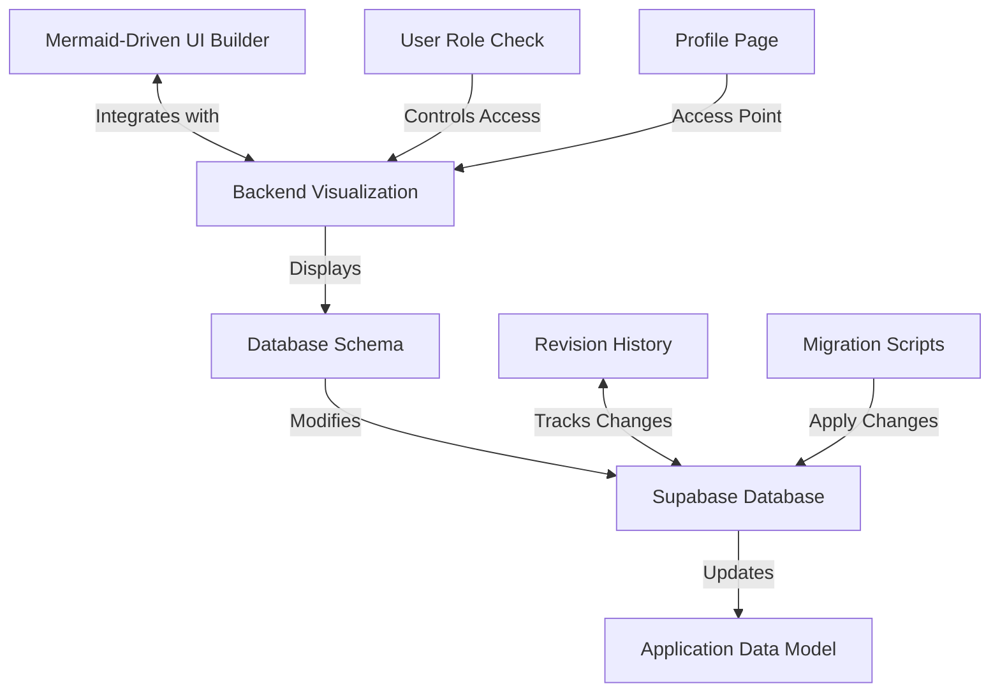

> [IMPORTED FROM CRM13] -- Reference only, not canonical

# Backend Visualization

## Overview

The Backend Visualization feature provides a visual interface for developers to understand and modify the database structure and relationships in the CRM system. It integrates with the [Mermaid-Driven UI Builder](./mermaid-ui-builder.md) (formerly the Puck editor) to allow for visual editing of database schemas, relationships, and configurations.

## Access Control

Access to the Backend Visualization is restricted to developer users only:

- Developer user email: `braden.lang77@gmail.com` (UID: `9600a18c-c8e3-44ef-83ad-99ede9268e77`)
- Access is controlled through user role checks in the database
- The visualization is accessible via the "Page Builder" tab in the user's Profile page

## Implementation Details

### Components

The Backend Visualization implementation consists of several key components:

- **SchemaVisualizer**: Displays database tables and their relationships
- **RelationshipEditor**: Allows editing of relationships between tables
- **FieldTypeEditor**: Provides interface for modifying field types
- **RevisionHistory**: Tracks changes to database schema

### Database Integration

The Backend Visualization integrates with the Supabase database:

- Schema information is retrieved from database metadata
- Changes are applied through SQL migrations
- Revision history is stored in the `page_revisions` table
- Tables are created automatically if they don't exist

### Visualization Features

The visualization provides several features:

- **Entity-Relationship Diagrams**: Visual representation of database tables and relationships
- **Schema Editing**: Interface for modifying table structures
- **Relationship Management**: Tools for creating and editing relationships
- **Field Type Configuration**: Options for setting field types and constraints

### Safety Measures

To ensure database integrity and prevent data loss:

- Changes are validated before being applied to the database
- Revision history is maintained for all schema changes
- Rollback functionality allows reverting to previous versions
- Database transactions ensure atomic operations
- Automatic migration scripts handle schema updates

## Integration with Mermaid-Driven UI Builder

The Backend Visualization is integrated with the Mermaid-Driven UI Builder (formerly Puck editor):

- Database schema changes can be made from within the UI Builder
- UI components can be linked to database fields
- Changes to database schema are reflected in the UI components
- Templates can include both UI and database configurations
- Mermaid diagrams can be used to visualize and edit database relationships

## Technical Architecture

## Usage Guidelines

When using the Backend Visualization:

1. Access the visualization through the "Page Builder" tab in your Profile page
2. View the current database schema in the entity-relationship diagram
3. Make changes to tables, fields, or relationships as needed
4. Save changes to create a new revision and apply migrations
5. Use the revision history to restore previous versions if needed
6. Test database changes thoroughly before applying to production
7. Document significant schema changes for other developers
