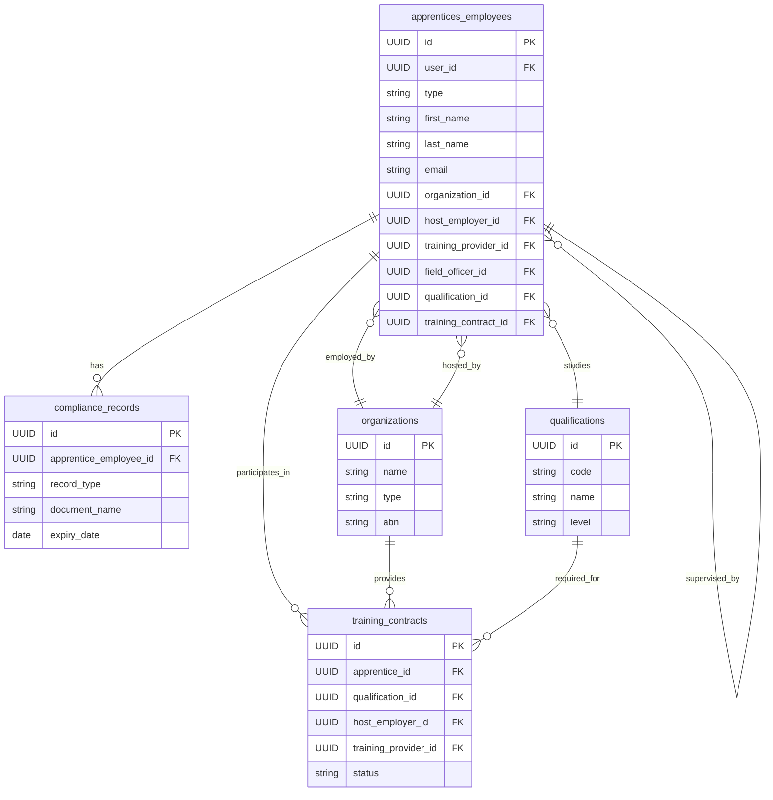

> [IMPORTED FROM CRM13] -- Reference only, not canonical

# Apprentice and Employee Schema Design

## Overview

This document outlines the data schema design for apprentices and employees in the CRM13 application, focusing on their relationships with organizations, qualifications, and compliance requirements.

## Primary Tables

### 1. apprentices_employees

The primary table storing apprentices and employees is the `apprentices_employees` table. This table has been designed to store all types of people in the system including:

- Apprentices
- Regular employees
- Field officers
- Staff members

```sql
CREATE TABLE IF NOT EXISTS apprentices_employees (
  id UUID PRIMARY KEY DEFAULT gen_random_uuid(),
  user_id UUID REFERENCES auth.users(id),
  type VARCHAR(50) NOT NULL, -- 'apprentice', 'employee', 'field_officer'
  first_name VARCHAR(255),
  last_name VARCHAR(255),
  email VARCHAR(255),
  phone VARCHAR(50),
  address TEXT,
  date_of_birth DATE,
  emergency_contact_name VARCHAR(255),
  emergency_contact_phone VARCHAR(50),
  start_date DATE,
  end_date DATE,
  employment_status VARCHAR(50),
  department VARCHAR(100),
  position VARCHAR(100),

  -- Relationships
  supervisor_id UUID,
  organization_id UUID,  -- The GTO or organization they work for
  host_employer_id UUID, -- For apprentices, their assigned host employer
  training_provider_id UUID, -- RTO providing the training
  field_officer_id UUID, -- Assigned field officer

  -- Apprentice specific fields
  training_contract_id UUID,
  qualification_id UUID,
  apprenticeship_status VARCHAR(50),

  -- Employee specific fields
  employee_id VARCHAR(50),
  employment_type VARCHAR(50), -- Full-time, Part-time, Casual
  pay_rate DECIMAL(10, 2),
  hours_per_week INT,

  -- Compliance fields
  tax_file_number VARCHAR(100),
  superannuation_fund VARCHAR(100),
  superannuation_member_number VARCHAR(100),

  -- Visa and work rights
  visa_status VARCHAR(100),
  visa_expiry DATE,
  blue_card_number VARCHAR(100),
  blue_card_expiry DATE,

  -- Qualification and training
  prior_qualifications TEXT[],
  english_proficiency VARCHAR(50),
  numeracy_level VARCHAR(50),

  -- Support requirements
  disability_details TEXT,
  support_requirements TEXT,

  -- Financial details
  funding_eligibility JSONB,

  -- History
  employment_history JSONB,
  preferred_industry TEXT[],
  relocation_willing BOOLEAN DEFAULT FALSE,

  -- Safety records
  safety_induction_date DATE,
  ppe_issued JSONB,
  incident_count INT DEFAULT 0,
  last_safety_review DATE,

  -- Common fields
  created_at TIMESTAMPTZ NOT NULL DEFAULT NOW(),
  updated_at TIMESTAMPTZ NOT NULL DEFAULT NOW(),
  metadata JSONB DEFAULT '{}'::jsonb,

  -- Explicit Foreign Key constraints defined separately
  CONSTRAINT fk_apprentices_supervisor FOREIGN KEY (supervisor_id)
    REFERENCES apprentices_employees(id) ON DELETE SET NULL
);

-- Indexes for key relationships
CREATE INDEX idx_apprentices_employees_organization ON apprentices_employees(organization_id);
CREATE INDEX idx_apprentices_employees_host_employer ON apprentices_employees(host_employer_id);
CREATE INDEX idx_apprentices_employees_training_provider ON apprentices_employees(training_provider_id);
CREATE INDEX idx_apprentices_employees_field_officer ON apprentices_employees(field_officer_id);
```

## Related Tables and Relationships

### 1. Organizations

Organizations include Group Training Organizations (GTOs), Host Employers, and Training Providers (RTOs).

```sql
CREATE TABLE IF NOT EXISTS organizations (
  id UUID PRIMARY KEY DEFAULT gen_random_uuid(),
  name VARCHAR(255) NOT NULL,
  type VARCHAR(50) NOT NULL, -- 'GTO', 'Host Employer', 'RTO', etc.
  abn VARCHAR(20),
  contact_name VARCHAR(255),
  contact_email VARCHAR(255),
  contact_phone VARCHAR(50),
  address TEXT,
  created_at TIMESTAMPTZ NOT NULL DEFAULT NOW(),
  updated_at TIMESTAMPTZ NOT NULL DEFAULT NOW()
);
```

### 2. Training Contracts

Training contracts link apprentices with their qualifications, host employers, and training providers.

```sql
CREATE TABLE IF NOT EXISTS training_contracts (
  id UUID PRIMARY KEY DEFAULT gen_random_uuid(),
  apprentice_id UUID REFERENCES apprentices_employees(id),
  qualification_id UUID REFERENCES qualifications(id),
  host_employer_id UUID REFERENCES organizations(id),
  training_provider_id UUID REFERENCES organizations(id),
  status VARCHAR(50) NOT NULL, -- 'Active', 'Completed', 'Suspended', etc.
  start_date DATE NOT NULL,
  expected_end_date DATE NOT NULL,
  actual_end_date DATE,
  contract_number VARCHAR(100),
  funding_source VARCHAR(100),
  funding_amount DECIMAL(10, 2),
  created_at TIMESTAMPTZ NOT NULL DEFAULT NOW(),
  updated_at TIMESTAMPTZ NOT NULL DEFAULT NOW()
);
```

### 3. Qualifications

```sql
CREATE TABLE IF NOT EXISTS qualifications (
  id UUID PRIMARY KEY DEFAULT gen_random_uuid(),
  code VARCHAR(50) NOT NULL,
  name VARCHAR(255) NOT NULL,
  level VARCHAR(20),
  description TEXT,
  training_package VARCHAR(100),
  nominal_hours INT,
  created_at TIMESTAMPTZ NOT NULL DEFAULT NOW(),
  updated_at TIMESTAMPTZ NOT NULL DEFAULT NOW()
);
```

### 4. Compliance Records

```sql
CREATE TABLE IF NOT EXISTS compliance_records (
  id UUID PRIMARY KEY DEFAULT gen_random_uuid(),
  apprentice_employee_id UUID REFERENCES apprentices_employees(id),
  record_type VARCHAR(50) NOT NULL, -- 'Tax', 'Safety', 'Qualification', etc.
  document_name VARCHAR(255),
  document_number VARCHAR(100),
  issue_date DATE,
  expiry_date DATE,
  status VARCHAR(50),
  document_url VARCHAR(500),
  notes TEXT,
  created_at TIMESTAMPTZ NOT NULL DEFAULT NOW(),
  updated_at TIMESTAMPTZ NOT NULL DEFAULT NOW()
);
```

## Relationship Diagram



## Implementation Strategy

1. **Data Migration**:
   - Existing user data from `auth.users` will be migrated to the `apprentices_employees` table
   - Type classification will be based on metadata in user profiles
   - Relationships to organizations, qualifications, etc. will be established where data exists

2. **Foreign Key Constraints**:
   - Foreign key constraints will be implemented to ensure data integrity
   - All relationships between tables will be properly defined

3. **Indexing**:
   - Appropriate indexes will be created for all relationship fields to ensure query performance
   - Composite indexes will be added for commonly queried combinations

4. **Application Layer**:
   - API services will be updated to use the new schema
   - Components will be updated to fetch data from the correct tables

## Queries for Common Operations

### Finding apprentices for a specific host employer

```sql
SELECT ae.*
FROM apprentices_employees ae
WHERE ae.type = 'apprentice'
AND ae.host_employer_id = 'host-employer-uuid';
```

### Finding all apprentices managed by a specific field officer

```sql
SELECT ae.*
FROM apprentices_employees ae
WHERE ae.type = 'apprentice'
AND ae.field_officer_id = 'field-officer-uuid';
```

### Finding all apprentices studying a specific qualification

```sql
SELECT ae.*
FROM apprentices_employees ae
JOIN training_contracts tc ON ae.id = tc.apprentice_id
WHERE ae.type = 'apprentice'
AND tc.qualification_id = 'qualification-uuid';
```

### Getting all compliance records for an apprentice

```sql
SELECT cr.*
FROM compliance_records cr
WHERE cr.apprentice_employee_id = 'apprentice-uuid';
```

### Finding apprentices with expiring documents

```sql
SELECT ae.*, cr.document_name, cr.expiry_date
FROM apprentices_employees ae
JOIN compliance_records cr ON ae.id = cr.apprentice_employee_id
WHERE cr.expiry_date < (CURRENT_DATE + INTERVAL '30 days')
ORDER BY cr.expiry_date;
