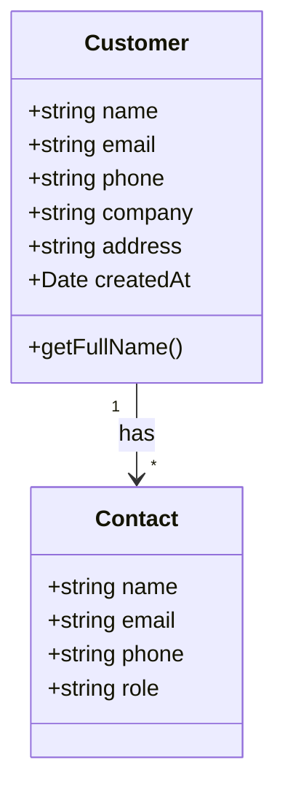

# Mermaid UI Builder Guide

## Table of Contents

1. [Overview](#overview)
2. [Architecture](#architecture)
3. [Key Components](#key-components)
4. [Usage Guide](#usage-guide)
5. [Developer Reference](#developer-reference)
6. [Form Generation](#form-generation)
7. [Template Library](#template-library)
8. [Workflow Builder](#workflow-builder)
9. [Transition from Puck Editor](#transition-from-puck-editor)
10. [Database Integration](#database-integration)
11. [Best Practices](#best-practices)

## Overview

The Mermaid UI Builder is a visual interface for creating and customizing UI components, pages, and database interactions in CRM13. It replaces the deprecated Puck editor with a more intuitive approach focused on data-driven UI generation.

### Key Features

- **Visual Interface**: Design UI components, forms, and workflows with an intuitive visual editor
- **Data-Driven**: Automatically generate forms and components based on database schema
- **Template Library**: Reuse pre-built components and layouts
- **Version Control**: Track changes and revert to previous versions
- **Role-Based Access**: Restricted to developer users only

### Access Control

The UI Builder is restricted to users with the developer role:

- Access via the "Page Builder" tab in the admin console
- Developer role required for access
- Changes can be scoped to organization or platform level

## Architecture

The Mermaid UI Builder follows a component-driven architecture built on React:

```
MermaidUIBuilder
├── EntityForms
│   ├── CustomerForm
│   ├── EmployeeForm
│   ├── CourseForm
│   └── EntityForm (generic)
├── FormGenerator
│   ├── FormGenerator
│   ├── FormCustomizer
│   └── FormGeneratorService
├── SchemaAnalyzer
│   ├── SchemaAnalyzer
│   └── SchemaAnalyzerService
├── TemplateLibrary
│   ├── TemplateLibrary
│   ├── TemplateCategory
│   ├── TemplateCard
│   └── TemplatePreview
└── Demo
```

### Design Principles

1. **One-Shot Data Entry**: Each piece of information should be entered only once
2. **Schema-Driven Forms**: Form structure based on database schema
3. **Role-Based Customization**: Components adapt to user roles
4. **Reusable Components**: Maximize component reuse across the application
5. **Graceful Degradation**: Fall back to standard forms when needed

## Key Components

### 1. Interactive Mermaid Diagrams

The UI Builder uses mermaid.js to create interactive diagrams that serve as both visualization and creation tools:

- Create entity relationship diagrams to visualize data models
- Define component hierarchies through diagram nodes
- Click on diagram nodes to edit properties
- Generate actual UI components and forms from diagrams
- Preview changes in real-time

Example mermaid diagram for a Customer entity:



### 2. Entity-Form Generator

Automatically creates CRUD forms based on database schema:

- Analyzes database tables and relationships
- Generates form components with proper validation
- Provides visual interface for form customization
- Supports both visual form building and code integration

Key components:
- `SchemaAnalyzer`: Analyzes Supabase table structures
- `FormGenerator`: Creates forms based on schema
- `FormCustomizer`: Visual interface for customizing forms

### 3. Template Library

Pre-built templates for common UI patterns:

- Dashboard widgets (stats, charts, lists)
- Data views (tables, cards, details)
- Form layouts (wizard, single-page, tabbed)
- Page templates (dashboard, details, landing)

Each template includes:
- Preview thumbnail
- Customization options
- Sample data integration
- Usage guidelines

### 4. Visual Workflow Builder

Define user interaction flows and navigation paths:

- Node-based editor for workflow creation
- Configure form submission processes
- Define conditional UI rendering rules
- Set up data validation workflows
- Implement state machine concepts

### 5. Quick Action System

Implement "Add New" functionality for all entity types:

- Floating action buttons for creating new entities
- Context-aware forms in modals or side panels
- Integration with navigation system's action buttons
- Customizable creation flows

## Usage Guide

### Getting Started

1. Navigate to the Admin Console
2. Select the "Page Builder" tab
3. Choose an entity type or template to start with
4. Use the visual editor to customize the component
5. Preview changes in real-time
6. Save and publish when ready

### Creating a New Form

1. Select "Create Form" from the builder interface
2. Choose the entity type (Customer, Employee, etc.)
3. The system will analyze the database schema
4. Customize field order, validation, and appearance
5. Add custom fields if needed
6. Configure submission behavior
7. Save the form

### Customizing Templates

1. Browse the Template Library
2. Select a template that matches your needs
3. Customize the template with the visual editor
4. Connect to data sources
5. Configure actions and events
6. Save as a new component or update existing

### Publishing Changes

1. Preview changes before publishing
2. Select the scope (organization or platform-wide)
3. Add a description of the changes
4. Publish to make the changes live
5. Changes are versioned for future reference

## Developer Reference

### Component API

```tsx
// Generic EntityForm
<EntityForm
  entityType="customers" // The table/entity name
  entityId={id} // Optional: For editing existing entity
  initialValues={{}} // Optional: Default values
  onSuccess={handleSuccess} // Callback on successful submit
  onCancel={handleCancel} // Callback on cancel
  layout="standard" // 'standard', 'compact', 'wizard'
  customFields={[]} // Custom field definitions
/>

// Specialized entity forms
<CustomerForm
  customerId={id} // Optional: For editing existing customer
  onSuccess={handleSuccess}
  onCancel={handleCancel}
/>

// Template usage
<TemplateCard
  template="dashboardStats"
  entity="employees"
  metrics={['count', 'active', 'onLeave']}
  period="month"
/>
```

### Form Generator API

```tsx
// Form generation service
const formConfig = FormGeneratorService.generateFormConfig({
  entityType: 'customers',
  fields: ['name', 'email', 'phone', 'address'],
  validation: {
    name: { required: true, minLength: 2 },
    email: { required: true, email: true }
  },
  layout: 'standard'
});

// Using generated config
<FormGenerator
  config={formConfig}
  onSubmit={handleSubmit}
/>
```

### Schema Analyzer API

```tsx
// Analyze schema for a specific table
const schemaInfo = await SchemaAnalyzerService.analyzeTable('customers');

// Get form fields based on schema
const formFields = SchemaAnalyzerService.getFormFields(schemaInfo);

// Checking relationships
const relationships = SchemaAnalyzerService.getRelationships('customers');
```

## Form Generation

The form generation process involves several steps:

1. **Schema Analysis**: Analyze database schema to identify fields, types, and relationships
2. **Field Mapping**: Map database types to appropriate form controls
3. **Validation Rules**: Generate validation rules based on constraints
4. **Layout Creation**: Organize fields into logical groups and sections
5. **UI Rendering**: Generate the React components for the form
6. **Logic Implementation**: Add form submission and validation logic

### Field Type Mapping

| Database Type | Form Control | Validation |
|---------------|--------------|------------|
| text, varchar | Text input | maxLength |
| integer, bigint | Number input | min, max |
| boolean | Checkbox/Toggle | - |
| date | Date picker | date format |
| timestamp | Date/time picker | datetime format |
| json, jsonb | JSON editor | JSON validation |
| enum | Select/Radio | enum values |
| uuid | Hidden/Text | UUID format |
| foreign key | Select/Lookup | exists |

### Advanced Form Features

- **Conditional Fields**: Show/hide fields based on other field values
- **Dynamic Validation**: Change validation rules based on context
- **Multi-step Forms**: Create wizard-style forms with progress tracking
- **File Uploads**: Handle file attachments with preview and validation
- **Rich Text**: Support markdown or WYSIWYG editing for content fields
- **Nested Forms**: Handle one-to-many relationships in a single form

## Template Library

The Template Library provides ready-to-use components for common UI patterns:

### Dashboard Templates

- **Stats Card**: Display key metrics with icons and trends
- **Chart Widget**: Visualize data with various chart types
- **Activity Feed**: Show recent activity with filters
- **Quick Actions**: Provide context-specific action buttons
- **Status Overview**: Display status of various entities

### Data View Templates

- **Data Table**: Customizable tables with sorting, filtering, pagination
- **Card Grid**: Display entities as cards in a responsive grid
- **Detail View**: Show entity details with related information
- **Calendar View**: Display events and appointments in calendar format
- **Map View**: Show location-based data on maps

### Form Templates

- **Standard Form**: Single-page form with all fields
- **Wizard Form**: Multi-step form with progress indicators
- **Inline Editing**: Edit data directly in tables or detail views
- **Quick Create**: Minimalist form for rapid data entry
- **Search Form**: Advanced search with multiple criteria

## Workflow Builder

The Visual Workflow Builder allows you to create complex user journeys:

### Key Concepts

- **Nodes**: Represent actions, decisions, or UI states
- **Edges**: Define flow between nodes
- **Triggers**: Events that start workflows
- **Actions**: Operations to perform
- **Conditions**: Logic for making decisions
- **States**: UI representations at each workflow step

### Workflow Types

- **Form Submission**: Control form validation and submission process
- **Approval Flow**: Create multi-step approval processes
- **Data Processing**: Automate data transformation and storage
- **User Onboarding**: Guide users through initial setup
- **Document Generation**: Create documents based on collected data

## Transition from Puck Editor

The Mermaid UI Builder replaces the Puck Editor, with several key improvements:

### Why We Migrated

- More intuitive interface focused on data-driven UIs
- Better integration with database schema
- Improved performance and reliability
- Support for complex workflows
- Role-based access control
- Version tracking and history

### Migration Process

1. **Identify Puck Components**: Inventory all existing Puck editor components
2. **Create Equivalent Templates**: Develop matching templates in the new system
3. **Migrate Content**: Transfer content to the new components
4. **Update References**: Update all references to Puck components
5. **Deprecate Puck**: Phase out Puck editor access
6. **Remove Code**: Remove Puck-related code and dependencies

### Compatibility Layer

For backward compatibility, we've implemented:

- A Puck component wrapper to render legacy components
- Data transformation to convert between formats
- Documentation for migrating custom Puck components

## Database Integration

The UI Builder integrates deeply with the database:

### Storage Tables

- `pages`: Stores page and component definitions
- `page_revisions`: Tracks version history
- `components`: Stores reusable component definitions
- `templates`: Stores template definitions
- `workflows`: Stores workflow definitions

### Security Model

- Row-level security ensures users can only access appropriate components
- Organization-scoped components only visible to that organization
- Platform-level components available to all organizations
- Developer role required for creating/editing components

### Entity Integration

The UI Builder directly integrates with entity tables:

- Automatically detects schema changes
- Updates forms when database schema changes
- Respects foreign key relationships
- Handles many-to-many relationships

## Best Practices

### Component Design

- **Keep It Simple**: Focus on solving one specific problem
- **Consistent Styling**: Follow the design system guidelines
- **Responsive Design**: Ensure components work on all device sizes
- **Accessibility**: Implement proper ARIA attributes and keyboard navigation
- **Error Handling**: Provide clear error states and recovery options

### Form Design

- **Group Related Fields**: Organize fields into logical sections
- **Clear Labels**: Use concise, descriptive labels
- **Inline Validation**: Provide immediate feedback on invalid input
- **Smart Defaults**: Pre-fill fields with sensible defaults when possible
- **Progressive Disclosure**: Show advanced options only when needed

### Template Usage

- **Start with Templates**: Begin with existing templates when possible
- **Customize Thoughtfully**: Only change what's necessary
- **Document Changes**: Add comments explaining customizations
- **Share Improvements**: If you enhance a template, contribute it back
- **Version Control**: Track template versions for reference

## Revision History

| Version | Date       | Description               | Author           |
| ------- | ---------- | ------------------------- | ---------------- |
| 1.2.0   | 2024-05-15 | Added Workflow Builder    | UI Team          |
| 1.1.0   | 2024-04-10 | Enhanced Template Library | Integration Team |
| 1.0.0   | 2024-03-01 | Initial release           | System Architect |