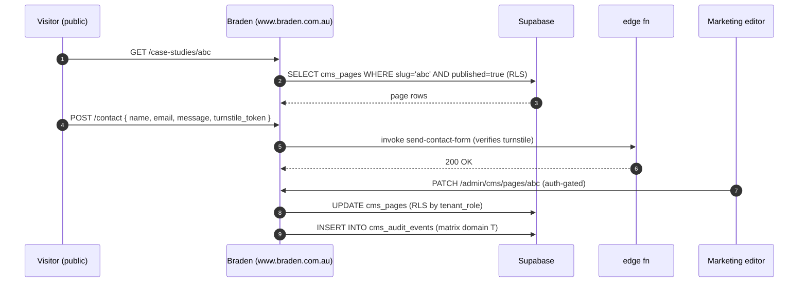

> ## ⚠ SUPERSEDED — 2026-08-17
>
> **This portal sub-plan is superseded by operator rulings D-93…D-98**
> (`../../20260814-portals-operator-rulings-v1.00A.md`, Approved 2026-08-14), and by the
> remediation programme in `../20260814-portals-and-surface-class-remediation-v1.00D.md`.
>
> The rulings decide, on the operator's own authority, several things these sub-plans assumed:
> a field officer is **staff**, not a portal persona; a host sees the **full charge-rate build-up**;
> a host **places staffing orders but does not browse workers**; payslips are a **viewer**; WHS
> questions match AnyTime; and bank/TFN/super are **out of scope** for the portals.
>
> **Cite the D-numbers. Do not re-derive a persona or a permission from this file** — that is the
> exact re-derivation the rulings were written to stop. Retained for its surface inventory.

# Portal — Braden Marketing

> Sub-plan of [`../20260506-codehouse-parity-and-platform-360-v1.00W.md`](../20260506-codehouse-parity-and-platform-360-v1.00W.md). Permissions: [`../../../AUTH_CANONICAL.md`](../../../AUTH_CANONICAL.md). Braden uses corporate branding (red `#ab233a` + gold `#cbb26a`) — **D2C theme NOT applied** per [`CLAUDE.md`](../../../CLAUDE.md).

Braden is the corporate website. Public-facing, CSP-hardened, bot-protected. Auth-gated CMS surface for marketing editors. Visual editing eventual scope (matrix row P2-5 — Phase 5 BL-008).

## Roles

| Role | Auth source | JWT claim / RLS reference |
|---|---|---|
| `public` | none (anonymous) | `auth.role() = 'anon'` — no DB writes; all content reads via `cms_pages WHERE published=true` (TODO: audit) |
| `marketing_editor` | BS OAuth 2.1 PKCE → Braden (client `dcb7af18-…`) | `tenant_role = 'marketing_editor'` — write on `cms_pages`, `cms_blocks`, `cms_assets` |
| `braden_admin` | BS OAuth 2.1 PKCE → Braden | `tenant_role = 'braden_admin'` — full CMS + analytics access |

## Capability matrix

| # | Capability | Roles | Route | RLS policy (or TODO) |
|---|---|---|---|---|
| 1 | Browse public marketing pages | public | `/`, `/services`, `/case-studies`, `/contact` | `cms_pages_public_select_published` (TODO: audit) |
| 2 | Submit contact form | public | `/contact` | edge fn `send-contact-form` with bot-protection (Cloudflare Turnstile or similar — matrix domain T) |
| 3 | CMS edit pages (block-based content) | marketing_editor, braden_admin | `/admin/cms`, `/admin/cms/pages/:slug` | `cms_pages_*`, `cms_blocks_*` (TODO: audit) |
| 4 | Visual editor (matrix row P2-5; deferred to BL-008 Phase 5) | braden_admin | `/admin/cms/visual` (TODO: confirm route) | uses `@bsuite/page-builder` |
| 5 | Asset library (images, PDFs) | marketing_editor, braden_admin | `/admin/cms/assets` | Supabase Storage bucket policy `cms-assets` (TODO: audit) |

## Data flow

## Upstream / downstream

| Entity / channel / fn | Direction | Notes |
|---|---|---|
| `cms_pages`, `cms_blocks`, `cms_assets`, `cms_audit_events` | read+write (auth-gated) | RLS by `tenant_role` |
| `cms_pages` (published=true) | read (public) | RLS-restricted to published rows |
| edge fn `send-contact-form` | call | with Turnstile verification |
| Supabase Storage `cms-assets` bucket | read+write | bucket policy by tenant_role |
| `@bsuite/page-builder` | in-process | for visual editor (P2-5 Phase 5) |
| `@bsuite/nav-core` (npm `^0.1.0`) | in-process | navigation primitives |

## Accessibility (WCAG 2.2)

- All public pages MUST achieve WCAG 2.2 AA: 4.5:1 contrast, focus-visible, keyboard-only navigation, alt text on all images.
- Corporate red `#ab233a` + gold `#cbb26a` palette: contrast must be re-verified in both light and dark mode (corporate doesn't have dark mode currently — confirm).
- Contact form: clear required-field markers, error association via `aria-describedby`.
- Bot-protection (Turnstile): MUST have accessible alternative path for users who fail / cannot complete (per WCAG 2.2 §3.3.8).
- CMS visual editor (P2-5) MUST be keyboard-navigable end-to-end before shipping to non-dev users.
- SEO + a11y heading hierarchy parity for crawler + screen-reader.

## Open questions

1. Is the corporate Braden branding ever rendered in dark mode? If not, document explicitly.
2. CSP headers in `vercel.json` — current state vs matrix row P2-8. Audit needed.
3. Is the visual editor scope (P2-5) compatible with the `/dev/feature-builder` (WS-E) tooling, or are they separate? File issue.
4. Bot protection — are we using Cloudflare Turnstile or hCaptcha? Confirm config + a11y fallback.
5. Asset library storage limits + per-tenant quotas — file issue.

## Citations

- [AUTH_CANONICAL.md](../../../AUTH_CANONICAL.md) — internal
- [`CLAUDE.md` — Braden branding rules](../../../CLAUDE.md) — internal (NOT D2C theme)
- [Cloudflare Turnstile 2026](https://developers.cloudflare.com/turnstile/) — bot protection
- [Supabase Storage RLS 2026](https://supabase.com/docs/guides/storage/security/access-control)
- [WCAG 2.2 — accessible authentication §3.3.8](https://www.w3.org/TR/WCAG22/#accessible-authentication-minimum)
- [Vercel CSP headers 2026](https://vercel.com/docs/headers/security-headers)
