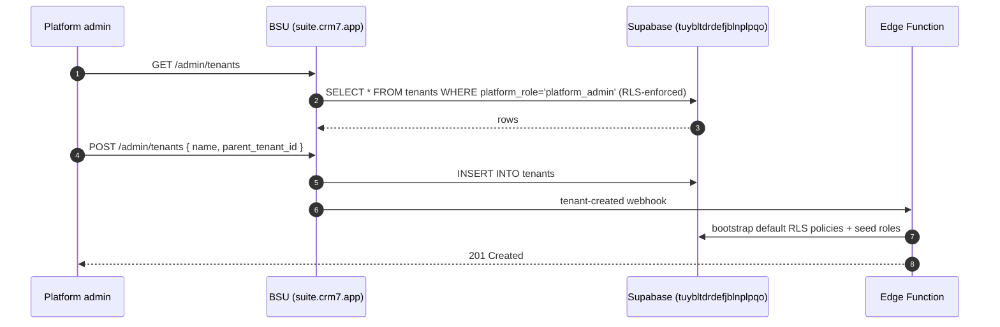

> ## ⚠ SUPERSEDED — 2026-08-17
>
> **This portal sub-plan is superseded by operator rulings D-93…D-98**
> (`../../20260814-portals-operator-rulings-v1.00A.md`, Approved 2026-08-14), and by the
> remediation programme in `../20260814-portals-and-surface-class-remediation-v1.00D.md`.
>
> The rulings decide, on the operator's own authority, several things these sub-plans assumed:
> a field officer is **staff**, not a portal persona; a host sees the **full charge-rate build-up**;
> a host **places staffing orders but does not browse workers**; payslips are a **viewer**; WHS
> questions match AnyTime; and bank/TFN/super are **out of scope** for the portals.
>
> **Cite the D-numbers. Do not re-derive a persona or a permission from this file** — that is the
> exact re-derivation the rulings were written to stop. Retained for its surface inventory.

# Portal — BSU Platform Admin

> Sub-plan of [`../20260506-codehouse-parity-and-platform-360-v1.00W.md`](../20260506-codehouse-parity-and-platform-360-v1.00W.md). Permissions model: [`../../../AUTH_CANONICAL.md`](../../../AUTH_CANONICAL.md).

BSU is the only OAuth 2.1 PKCE server across the suite (consent screen at `/oauth/consent`, JWKS endpoint at `/.well-known/jwks.json`). The platform admin portal manages tenants, sub-organisations, branding, billing, and the dev-account-only visual feature builder (WS-E).

## Roles

| Role | Auth source | JWT claim / RLS reference |
|---|---|---|
| `platform_admin` | BSU Supabase Native Auth + custom claim | `app_metadata.platform_role = 'platform_admin'` (cite [AUTH_CANONICAL.md §4](../../../AUTH_CANONICAL.md)) |
| `platform_developer` | BSU Supabase Native Auth + custom claim | `app_metadata.platform_role = 'developer'` — gates `/dev/feature-builder` |
| `support_agent` | BSU Supabase Native Auth + custom claim | `app_metadata.platform_role = 'support'` — read-only on tenant data |

## Capability matrix

| # | Capability | Roles | Route | RLS policy file (or TODO) |
|---|---|---|---|---|
| 1 | List/CRUD tenants | platform_admin | `/admin/tenants` | `bsu/supabase/migrations/*tenant*` (TODO: audit policy names) |
| 2 | Sub-organisation hierarchy admin | platform_admin | `/admin/tenants/:id/sub-organizations` | `tenants_parent_tenant_id_select`, `tenants_parent_tenant_id_update` (TODO: audit) |
| 3 | Per-tenant runtime OKLCH branding | platform_admin | `/admin/tenants/:id/branding` | `tenant_settings_*` policies (TODO: audit) |
| 4 | OAuth consent screen | (any signed-in BSU user — consents on behalf of self) | `/oauth/consent` | N/A (server-side route, signed-state validation) |
| 5 | Visual feature builder (dev-only) | platform_developer, platform_admin | `/dev/feature-builder` | TODO: audit — gating is client-side + server-side checked against JWT claim |
| 6 | Audit log viewer | platform_admin | `/admin/audit` | TODO: audit `audit_events` RLS |

## Data flow

## Upstream / downstream

| Entity / channel / fn | Direction | Notes |
|---|---|---|
| `tenants`, `tenant_settings`, `sub_organizations`, `audit_events` | read+write | core admin entities |
| `auth.users` (Supabase) | read | platform-level user list |
| `realtime:tenant_settings:*` | subscribe | live propagation of branding changes to consumer apps |
| edge fn `tenant-bootstrap` | call | on tenant creation |
| edge fn `oauth-token` (JWT issuance) | call | OAuth 2.1 PKCE token endpoint |

## Accessibility (WCAG 2.2)

- Tenant list table: focus-visible on each row + `role="grid"` semantics (cite [WCAG 2.2 — focus-visible](https://www.w3.org/TR/WCAG22/#focus-visible)).
- Consent screen MUST surface scopes as `aria-described-by` on the Approve button (status-message live region).
- Branding preview iframe MUST be labelled with `title` attribute.

## Open questions

1. Are platform-role claims set via a Supabase trigger or a manual `app_metadata` update? Need an issue to formalise.
2. Is `audit_events` RLS scoped to `platform_admin` only, or are tenant admins also allowed read-access? File issue.
3. Does the OAuth consent screen meet WCAG 2.2 §3.3.7 (redundant entry)? Audit needed.

## Citations

- [AUTH_CANONICAL.md](../../../AUTH_CANONICAL.md) — internal
- [Supabase RLS 2026 best practices](https://supabase.com/docs/guides/database/postgres/row-level-security)
- [Supabase multi-tenancy 2026](https://supabase.com/docs/guides/auth/multi-tenant)
- [WCAG 2.2 — focus-visible + status messages](https://www.w3.org/TR/WCAG22/)
- [GitHub Projects v2 — task-list-tracking on issues (2026)](https://docs.github.com/en/issues/planning-and-tracking-with-projects)
