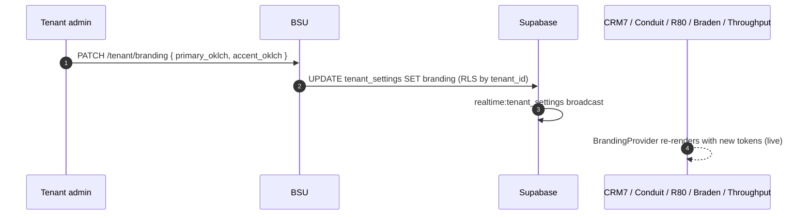

> ## ⚠ SUPERSEDED — 2026-08-17
>
> **This portal sub-plan is superseded by operator rulings D-93…D-98**
> (`../../20260814-portals-operator-rulings-v1.00A.md`, Approved 2026-08-14), and by the
> remediation programme in `../20260814-portals-and-surface-class-remediation-v1.00D.md`.
>
> The rulings decide, on the operator's own authority, several things these sub-plans assumed:
> a field officer is **staff**, not a portal persona; a host sees the **full charge-rate build-up**;
> a host **places staffing orders but does not browse workers**; payslips are a **viewer**; WHS
> questions match AnyTime; and bank/TFN/super are **out of scope** for the portals.
>
> **Cite the D-numbers. Do not re-derive a persona or a permission from this file** — that is the
> exact re-derivation the rulings were written to stop. Retained for its surface inventory.

# Portal — BSU Tenant Admin

> Sub-plan of [`../20260506-codehouse-parity-and-platform-360-v1.00W.md`](../20260506-codehouse-parity-and-platform-360-v1.00W.md). Permissions: [`../../../AUTH_CANONICAL.md`](../../../AUTH_CANONICAL.md). Distinct from BSU platform admin (which manages tenants from above) — this portal manages a single tenant from inside.

## Roles

| Role | Auth source | JWT claim / RLS reference |
|---|---|---|
| `tenant_admin` | BSU Supabase Native Auth → custom claim | `app_metadata.tenant_role = 'admin'` + `tenant_id = <uuid>` (cite [AUTH_CANONICAL.md](../../../AUTH_CANONICAL.md)) |
| `tenant_billing_admin` | BSU Supabase Native Auth | `app_metadata.tenant_role = 'billing_admin'` — restricted to billing surface (matrix row P2-15 — Stripe/Xero) |
| `tenant_branding_editor` | BSU Supabase Native Auth | `app_metadata.tenant_role = 'branding_editor'` — restricted to OKLCH branding tokens |

## Capability matrix

| # | Capability | Roles | Route | RLS policy (or TODO) |
|---|---|---|---|---|
| 1 | Tenant user list + role assignment | tenant_admin | `/tenant/users` | `tenant_users_*` (TODO: audit) |
| 2 | Role + permission management | tenant_admin | `/tenant/roles` | `tenant_roles_*` — uses Supabase RLS, NOT a new RBAC framework (per operator decision) |
| 3 | Runtime OKLCH branding editor | tenant_admin, tenant_branding_editor | `/tenant/branding` | `tenant_settings_branding_*` (TODO: audit) |
| 4 | Stripe / Xero billing config | tenant_admin, tenant_billing_admin | `/tenant/billing` | `tenant_settings_billing_*` (TODO: audit; matrix row P2-15) |
| 5 | Sub-organisation tree CRUD (matrix advantage #3) | tenant_admin | `/tenant/sub-organizations` | `sub_organizations_*` (TODO: audit; matrix row P2-13) |
| 6 | Feature flags admin (37 JSONB flags — matrix row P2-14) | tenant_admin | `/tenant/feature-flags` | `tenant_settings_feature_flags_*` (TODO: audit) |

## Data flow

## Upstream / downstream

| Entity / channel / fn | Direction | Notes |
|---|---|---|
| `tenants`, `tenant_settings`, `tenant_users`, `tenant_roles`, `sub_organizations` | read+write (own tenant only) | RLS by tenant_id JWT claim |
| `realtime:tenant_settings:<tenant_id>` | broadcast | live propagation to consumer apps (matrix advantage #3) |
| edge fn `tenant-invite-user` | call | email invite + first-time-login flow |
| edge fn `stripe-billing-sync` | call | subscription tier sync |
| edge fn `tenant-feature-flag-evaluate` | call (read-side) | LaunchDarkly-style evaluation; 37 flags per matrix row P2-14 |

## Accessibility (WCAG 2.2)

- Branding OKLCH editor MUST surface preview contrast ratios (WCAG 1.4.3) live as user adjusts tokens.
- Role assignment matrix MUST be keyboard-navigable (`role="grid"`).
- Feature-flag toggles MUST have visible focus rings (WCAG 2.4.7) and `aria-pressed` state.
- Sub-organisation tree (drag-to-reparent) MUST have keyboard equivalent ([@dnd-kit/abstract](https://dndkit.com/)).
- Billing screens: never display PCI-relevant data (Stripe handles via iframes); enforce CSP per matrix row P2-8.

## Open questions

1. Is `tenant_role` a JWT claim or a `tenant_users` table column? Pick one (operator decision: claim → matches AUTH_CANONICAL.md).
2. Sub-organisation depth limit — file issue. Matrix advantage #3 implies arbitrary depth; UX may need a soft cap.
3. RLS for cross-sub-org reads (parent tenant should see child rows)? File issue; auditing needed.
4. Are feature flags read in real-time or cached client-side per session? Matrix row P2-14 dependency.
5. Tenant-scoped audit log retention — does it follow platform `audit_events` policy or have its own? File issue.

## Citations

- [AUTH_CANONICAL.md](../../../AUTH_CANONICAL.md) — internal
- [Supabase RLS — multi-tenant patterns 2026](https://supabase.com/docs/guides/auth/multi-tenant)
- [Supabase Realtime broadcast 2026](https://supabase.com/docs/guides/realtime/broadcast)
- [WCAG 2.2 — focus visible §2.4.7](https://www.w3.org/TR/WCAG22/#focus-visible)
- [WCAG 2.2 — non-text contrast §1.4.11](https://www.w3.org/TR/WCAG22/#non-text-contrast)
- [Stripe Billing 2026](https://docs.stripe.com/billing)
