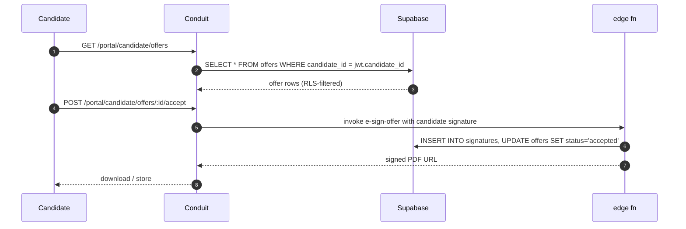

> ## ⚠ SUPERSEDED — 2026-08-17
>
> **This portal sub-plan is superseded by operator rulings D-93…D-98**
> (`../../20260814-portals-operator-rulings-v1.00A.md`, Approved 2026-08-14), and by the
> remediation programme in `../20260814-portals-and-surface-class-remediation-v1.00D.md`.
>
> The rulings decide, on the operator's own authority, several things these sub-plans assumed:
> a field officer is **staff**, not a portal persona; a host sees the **full charge-rate build-up**;
> a host **places staffing orders but does not browse workers**; payslips are a **viewer**; WHS
> questions match AnyTime; and bank/TFN/super are **out of scope** for the portals.
>
> **Cite the D-numbers. Do not re-derive a persona or a permission from this file** — that is the
> exact re-derivation the rulings were written to stop. Retained for its surface inventory.

# Portal — Conduit Candidate

> Sub-plan of [`../20260506-codehouse-parity-and-platform-360-v1.00W.md`](../20260506-codehouse-parity-and-platform-360-v1.00W.md). Permissions: [`../../../AUTH_CANONICAL.md`](../../../AUTH_CANONICAL.md).

The candidate self-service portal is part of Conduit's better-than-Codehouse ATS depth (parity matrix advantage #5). It supports apply → interview → offer → onboarding flow with e-sign integration.

## Roles

| Role | Auth source | JWT claim / RLS reference |
|---|---|---|
| `candidate` | Conduit Supabase Native Auth (no BS OAuth — candidates aren't tenant users) | `app_metadata.candidate_id = <uuid>` — RLS on `applications`, `interviews`, `offers` filtered by candidate_id (cite [AUTH_CANONICAL.md](../../../AUTH_CANONICAL.md)) |

## Capability matrix

| # | Capability | Roles | Route | RLS policy (or TODO) |
|---|---|---|---|---|
| 1 | View own applications + status | candidate | `/portal/candidate/applications` | `applications_select_own` (TODO: audit policy name) |
| 2 | Schedule / accept / decline interviews | candidate | `/portal/candidate/interviews` | `interviews_update_own` (TODO: audit) |
| 3 | View / accept / decline offers (e-sign) | candidate | `/portal/candidate/offers` | `offers_select_own`, `signatures_insert_own` (TODO: audit) |
| 4 | Onboarding documents (TFN, super choice, bank, ID) | candidate | `/portal/candidate/onboarding` | `r7_documents_*_own` (TODO: audit; matrix row P2-17 dependency) |
| 5 | Profile management (name, contact, résumé, right-to-work) | candidate | `/portal/candidate/profile` | `candidates_update_own` (TODO: audit) |

## Data flow

## Upstream / downstream

| Entity / channel / fn | Direction | Notes |
|---|---|---|
| `applications`, `interviews`, `offers`, `signatures`, `r7_documents`, `candidates` | read (own) + write (own) | strict RLS by candidate_id JWT claim |
| `realtime:applications:<candidate_id>` | subscribe | own application status changes |
| edge fn `e-sign-offer` | call | offer acceptance + signed PDF generation |
| edge fn `verify-right-to-work` (matrix domain R) | call | TODO: confirm wiring |

## Accessibility (WCAG 2.2)

- E-sign flow MUST be keyboard-only navigable end-to-end (signature canvas + alt typed-name path per [WCAG 2.2 §2.1](https://www.w3.org/TR/WCAG22/)).
- Offer detail page: read-aloud-friendly heading hierarchy + summary table semantics.
- Onboarding doc upload: clear file-type / size restrictions surfaced as `aria-describedby` on file input.
- Interview scheduling: timezone-aware date display with `<time datetime="…">`.
- Mobile-first responsiveness — most candidates apply on mobile (matrix domain O).

## Open questions

1. Is candidate auth purely Supabase Native, or do we want BS OAuth client for candidates accessing the careers portal? File issue.
2. RLS policies for `_own` patterns — is the `auth.jwt() ->> 'candidate_id'` pattern used everywhere, or are some tables filtered by `auth.uid()` directly? Audit.
3. Is the e-sign offer flow CSP-compatible with the Conduit `vercel.json` headers (matrix row P2-8 dependency)?
4. Does the onboarding flow surface progress per WCAG status messages?

## Citations

- [AUTH_CANONICAL.md](../../../AUTH_CANONICAL.md) — internal
- [Supabase RLS — JWT claims pattern 2026](https://supabase.com/docs/guides/database/postgres/row-level-security)
- [Next.js 16 App Router — server components 2026](https://nextjs.org/docs/app/building-your-application/rendering/server-components)
- [WCAG 2.2 — keyboard accessible §2.1](https://www.w3.org/TR/WCAG22/#keyboard-accessible)
- [WCAG 2.2 — accessible authentication §3.3.8](https://www.w3.org/TR/WCAG22/#accessible-authentication-minimum)
