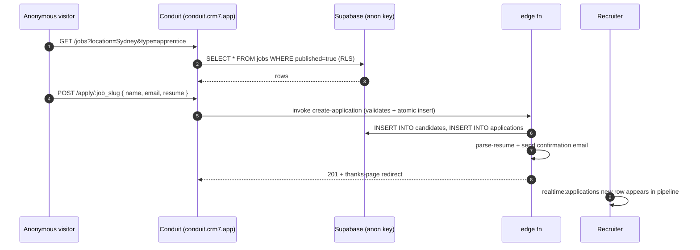

> ## ⚠ SUPERSEDED — 2026-08-17
>
> **This portal sub-plan is superseded by operator rulings D-93…D-98**
> (`../../20260814-portals-operator-rulings-v1.00A.md`, Approved 2026-08-14), and by the
> remediation programme in `../20260814-portals-and-surface-class-remediation-v1.00D.md`.
>
> The rulings decide, on the operator's own authority, several things these sub-plans assumed:
> a field officer is **staff**, not a portal persona; a host sees the **full charge-rate build-up**;
> a host **places staffing orders but does not browse workers**; payslips are a **viewer**; WHS
> questions match AnyTime; and bank/TFN/super are **out of scope** for the portals.
>
> **Cite the D-numbers. Do not re-derive a persona or a permission from this file** — that is the
> exact re-derivation the rulings were written to stop. Retained for its surface inventory.

# Portal — Conduit Careers (Public)

> Sub-plan of [`../20260506-codehouse-parity-and-platform-360-v1.00W.md`](../20260506-codehouse-parity-and-platform-360-v1.00W.md). Permissions: [`../../../AUTH_CANONICAL.md`](../../../AUTH_CANONICAL.md).

The careers portal is unauthenticated. Codehouse offers no public job-board (matrix top-5 advantage). RLS for public reads is permissive on `jobs WHERE published=true`; everything else requires auth.

## Roles

| Role | Auth source | JWT claim / RLS reference |
|---|---|---|
| `public` | none (anonymous Supabase anon-key reads) | `auth.role() = 'anon'` — RLS allows SELECT on `jobs WHERE published=true AND tenant_id = <derived from subdomain or query>` (TODO: audit) |
| `candidate` (post-application) | Conduit Supabase Native Auth (auto-created on first apply) | becomes `candidate` role per [`20260506-portal-conduit-candidate-v1.00F.md`](./20260506-portal-conduit-candidate-v1.00F.md) |

## Capability matrix

| # | Capability | Roles | Route | RLS policy (or TODO) |
|---|---|---|---|---|
| 1 | Browse published jobs (search + filter) | public | `/jobs` | `jobs_public_select_published` (TODO: audit policy) |
| 2 | View job detail | public | `/jobs/:slug` | same as #1 |
| 3 | Submit application (anonymous) | public | `/apply/:job_slug` | `applications_insert_anon` + auto-create `candidates` row (TODO: audit; consider edge fn for atomicity) |
| 4 | Sign up / link existing account | public → candidate | `/apply/:job_slug?step=account` | becomes `candidate` (see candidate sub-plan) |
| 5 | View "thank you / next steps" page | public | `/apply/:job_slug/thanks` | static |

## Data flow

## Upstream / downstream

| Entity / channel / fn | Direction | Notes |
|---|---|---|
| `jobs` | read (public, published=true only) | RLS-restricted by `published=true` |
| `applications`, `candidates` | write (via edge fn only) | client never writes directly — edge fn enforces de-dupe + email-uniqueness |
| edge fn `create-application` | call | atomic insert + résumé parse + confirmation email |
| edge fn `parse-resume` | call | LLM extraction |
| edge fn `send-application-confirmation` | call | templated email |
| Realtime channels | NOT used (public portal does not subscribe) | — |

## Accessibility (WCAG 2.2)

- Job-search form MUST have proper labels + autocomplete attributes per [WCAG 2.2 §1.3.5](https://www.w3.org/TR/WCAG22/#identify-input-purpose).
- Application form: clear required-field markers, error messages associated via `aria-describedby`.
- Résumé file upload: client-side file-type and size validation surfaced via `aria-invalid`.
- Mobile-first responsive layout — most public traffic is mobile (matrix domain O).
- Page-load performance: Web Vitals INP < 200ms (matrix row P2-21 dependency).
- SEO + a11y heading hierarchy for crawler + screen-reader parity.

## Open questions

1. Tenant scoping for the public portal — is each tenant's job board on a subdomain (e.g. `<tenant>.conduit.crm7.app`) or a path? Confirm.
2. Captcha / bot protection on the apply form — matrix domain T (audit) consideration.
3. Is the "create candidate from application" idempotent on email match, or do we always create a new candidate? File issue (UX — duplicate candidates problem).
4. Does the careers portal honour the tenant's runtime OKLCH branding (BSU-driven) or use Conduit defaults?

## Citations

- [AUTH_CANONICAL.md](../../../AUTH_CANONICAL.md) — internal
- [Supabase anon-key RLS patterns 2026](https://supabase.com/docs/guides/database/postgres/row-level-security)
- [Next.js 16 — Server Components + ISR for public pages 2026](https://nextjs.org/docs/app/building-your-application/data-fetching)
- [WCAG 2.2 — identify input purpose §1.3.5](https://www.w3.org/TR/WCAG22/#identify-input-purpose)
- [Web Vitals 2026](https://web.dev/articles/vitals)
