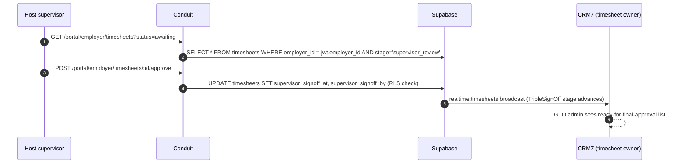

> ## ⚠ SUPERSEDED — 2026-08-17
>
> **This portal sub-plan is superseded by operator rulings D-93…D-98**
> (`../../20260814-portals-operator-rulings-v1.00A.md`, Approved 2026-08-14), and by the
> remediation programme in `../20260814-portals-and-surface-class-remediation-v1.00D.md`.
>
> The rulings decide, on the operator's own authority, several things these sub-plans assumed:
> a field officer is **staff**, not a portal persona; a host sees the **full charge-rate build-up**;
> a host **places staffing orders but does not browse workers**; payslips are a **viewer**; WHS
> questions match AnyTime; and bank/TFN/super are **out of scope** for the portals.
>
> **Cite the D-numbers. Do not re-derive a persona or a permission from this file** — that is the
> exact re-derivation the rulings were written to stop. Retained for its surface inventory.

# Portal — Conduit Employer

> Sub-plan of [`../20260506-codehouse-parity-and-platform-360-v1.00W.md`](../20260506-codehouse-parity-and-platform-360-v1.00W.md). Permissions: [`../../../AUTH_CANONICAL.md`](../../../AUTH_CANONICAL.md).

Employer-portal users are external client / host companies. Codehouse equivalent: OTS Client Guide flows. This portal underpins the host-supervisor leg of the TripleSignOff approval (matrix row 14 — better-than-Codehouse).

## Roles

| Role | Auth source | JWT claim / RLS reference |
|---|---|---|
| `employer_admin` | Conduit Supabase Native Auth | `app_metadata.employer_id = <uuid>` — RLS on `jobs`, `placements`, `timesheets` filtered by employer_id (cite [AUTH_CANONICAL.md](../../../AUTH_CANONICAL.md)) |
| `employer_supervisor` | Conduit Supabase Native Auth | `app_metadata.employer_id = <uuid>` + `employer_role = 'supervisor'` — restricted to timesheet approvals only |

## Capability matrix

| # | Capability | Roles | Route | RLS policy (or TODO) |
|---|---|---|---|---|
| 1 | Submit / list job orders | employer_admin | `/portal/employer/jobs`, `/portal/employer/jobs/new` | `jobs_select_employer`, `jobs_insert_employer` (TODO: audit) |
| 2 | Review shortlisted candidates | employer_admin | `/portal/employer/candidates` | `candidates_select_via_application_employer` (TODO: audit — read-only) |
| 3 | Approve placements | employer_admin | `/portal/employer/placements` | `placements_update_employer_approval` (TODO: audit) |
| 4 | Approve / reject timesheets (host-supervisor leg) | employer_admin, employer_supervisor | `/portal/employer/timesheets` | `timesheets_update_supervisor_signoff` (TODO: audit; matrix row 14) |
| 5 | View placement reports (hours, billing) | employer_admin | `/portal/employer/reports` (TODO: confirm route exists) | `report_templates_employer` (TODO: audit) |

## Data flow

## Upstream / downstream

| Entity / channel / fn | Direction | Notes |
|---|---|---|
| `jobs`, `placements`, `timesheets`, `applications` | read+write (employer-scoped) | RLS by employer_id JWT claim |
| `candidates` | read-only (via approved applications only) | scoped read |
| `realtime:timesheets:<employer_id>` | subscribe | live awaiting-approval list |
| edge fn `notify-employer-timesheet-awaiting` | called by CRM7 | matrix row 18 (partial) — wire SMS/email |
| edge fn `notify-employer-placement-approved` | called by CRM7 | TODO: confirm |

## Accessibility (WCAG 2.2)

- Bulk approve action MUST have confirmation dialog with focus-trap (matrix row 15 — partial).
- Timesheet detail panel: timesheet table read order MUST be logical for screen readers.
- Approve / Reject buttons MUST have ≥ 4.5:1 contrast in both light and dark D2C theme.
- Reject flow MUST require a typed reason (matrix row 16 — parity).

## Open questions

1. Does the employer portal share the Conduit BS OAuth client or use separate Supabase Native Auth? Confirm — matrix domain Q dependency.
2. RLS for cross-tenant placements (when an employer works with multiple GTO tenants) — file issue.
3. Are timesheet rejections cascaded back to the apprentice via the `notify-rejection` edge fn (matrix row 19)?
4. Is the supervisor_signoff stored in `timesheets` directly or a separate `signatures` table? Audit.

## Citations

- [AUTH_CANONICAL.md](../../../AUTH_CANONICAL.md) — internal
- [Supabase RLS 2026](https://supabase.com/docs/guides/database/postgres/row-level-security)
- [Supabase Realtime broadcast 2026](https://supabase.com/docs/guides/realtime/broadcast)
- [WCAG 2.2 — focus-visible §2.4.7](https://www.w3.org/TR/WCAG22/#focus-visible)
- [WCAG 2.2 — contrast §1.4.3](https://www.w3.org/TR/WCAG22/#contrast-minimum)
