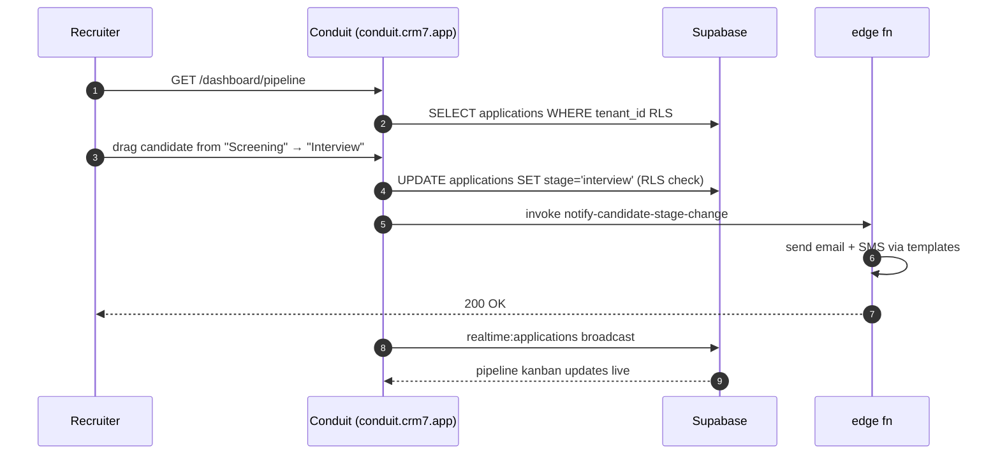

> ## ⚠ SUPERSEDED — 2026-08-17
>
> **This portal sub-plan is superseded by operator rulings D-93…D-98**
> (`../../20260814-portals-operator-rulings-v1.00A.md`, Approved 2026-08-14), and by the
> remediation programme in `../20260814-portals-and-surface-class-remediation-v1.00D.md`.
>
> The rulings decide, on the operator's own authority, several things these sub-plans assumed:
> a field officer is **staff**, not a portal persona; a host sees the **full charge-rate build-up**;
> a host **places staffing orders but does not browse workers**; payslips are a **viewer**; WHS
> questions match AnyTime; and bank/TFN/super are **out of scope** for the portals.
>
> **Cite the D-numbers. Do not re-derive a persona or a permission from this file** — that is the
> exact re-derivation the rulings were written to stop. Retained for its surface inventory.

# Portal — Conduit Recruiter

> Sub-plan of [`../20260506-codehouse-parity-and-platform-360-v1.00W.md`](../20260506-codehouse-parity-and-platform-360-v1.00W.md). Permissions: [`../../../AUTH_CANONICAL.md`](../../../AUTH_CANONICAL.md).

Conduit is Next.js 16 App Router. The recruiter portal handles ATS pipeline operations. **Better-than-Codehouse** parity in this portal (matrix top-5 advantages: full ATS pipeline + public job board).

## Roles

| Role | Auth source | JWT claim / RLS reference |
|---|---|---|
| `recruiter` | BS OAuth 2.1 PKCE → Conduit (client `da925c19-…`) | `tenant_role = 'recruiter'` — RLS on `candidates`, `jobs`, `applications` (cite [AUTH_CANONICAL.md](../../../AUTH_CANONICAL.md)) |
| `recruiter_lead` | BS OAuth 2.1 PKCE → Conduit | `tenant_role = 'recruiter_lead'` — full read across recruiter scope |
| `conduit_admin` | BS OAuth 2.1 PKCE → Conduit | `tenant_role = 'conduit_admin'` — superuser within tenant |

## Capability matrix

| # | Capability | Roles | Route | RLS policy (or TODO) |
|---|---|---|---|---|
| 1 | Candidate CRUD + résumé parsing | recruiter, recruiter_lead, conduit_admin | `/dashboard/candidates`, `/dashboard/candidates/:id` | `candidates_*` (TODO: audit) |
| 2 | Job-order CRUD | recruiter, conduit_admin | `/dashboard/jobs`, `/dashboard/jobs/:id` | `jobs_*` (TODO: audit) |
| 3 | Drag-and-drop pipeline kanban | recruiter, recruiter_lead | `/dashboard/pipeline` | `applications_update` (TODO: audit; column moves are RLS-restricted updates) |
| 4 | Interview scheduling | recruiter, recruiter_lead | `/dashboard/interviews` | `interviews_*` (TODO: audit) |
| 5 | Offer management + e-sign trigger | recruiter_lead, conduit_admin | `/dashboard/offers` | `offers_*` (TODO: audit) |
| 6 | ATS reports (time-to-hire, source-of-hire) | recruiter_lead, conduit_admin | `/dashboard/reports` | `report_templates_*` (TODO: audit) |

## Data flow

## Upstream / downstream

| Entity / channel / fn | Direction | Notes |
|---|---|---|
| `candidates`, `jobs`, `applications`, `interviews`, `offers`, `r7_documents` | read+write | core ATS entities |
| `tenants`, `tenant_settings` | read | from BSU |
| `realtime:applications:*` | subscribe | live pipeline kanban updates |
| edge fn `notify-candidate-stage-change` | call | email + SMS templates |
| edge fn `parse-resume` | call | LLM résumé extraction |
| edge fn `e-sign-offer` | call | TODO: confirm wiring |

## Accessibility (WCAG 2.2)

- Drag-and-drop kanban MUST have keyboard equivalents (`@dnd-kit/abstract` Snap modifier — bsuite#547 dependency).
- Stage-change announcements via `aria-live="polite"` status region.
- Candidate detail panel: focus-trap when used as modal sheet; focus-restore on close.
- Interview scheduler date-picker MUST respect `prefers-reduced-motion`.

## Open questions

1. Is the bsuite#547 (`@dnd-kit/abstract` Snap modifier) issue closed before pipeline kanban ships? Confirm.
2. RLS for `r7_documents` on candidate documents tab — is matrix row P2-17 wired?
3. Does the offer e-sign edge fn integrate with `crm7/src/pages/documents/signatures.tsx` or is it independent?
4. Are recruiter reports tenant-scoped only or do they expose cross-tenant data to recruiter_lead?

## Citations

- [AUTH_CANONICAL.md](../../../AUTH_CANONICAL.md) — internal
- [Next.js 16 App Router 2026](https://nextjs.org/docs/app)
- [Supabase Realtime broadcast 2026](https://supabase.com/docs/guides/realtime/broadcast)
- [@dnd-kit/abstract Snap modifier](https://dndkit.com/extend/modifiers)
- [WCAG 2.2 — keyboard equivalents §2.1](https://www.w3.org/TR/WCAG22/#keyboard-accessible)
- [TanStack Query 2026](https://tanstack.com/query/latest/docs/framework/react/overview)
