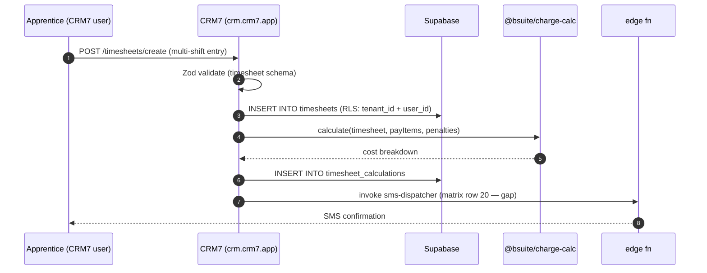

> ## ⚠ SUPERSEDED — 2026-08-17
>
> **This portal sub-plan is superseded by operator rulings D-93…D-98**
> (`../../20260814-portals-operator-rulings-v1.00A.md`, Approved 2026-08-14), and by the
> remediation programme in `../20260814-portals-and-surface-class-remediation-v1.00D.md`.
>
> The rulings decide, on the operator's own authority, several things these sub-plans assumed:
> a field officer is **staff**, not a portal persona; a host sees the **full charge-rate build-up**;
> a host **places staffing orders but does not browse workers**; payslips are a **viewer**; WHS
> questions match AnyTime; and bank/TFN/super are **out of scope** for the portals.
>
> **Cite the D-numbers. Do not re-derive a persona or a permission from this file** — that is the
> exact re-derivation the rulings were written to stop. Retained for its surface inventory.

# Portal — CRM7 Internal

> Sub-plan of [`../20260506-codehouse-parity-and-platform-360-v1.00W.md`](../20260506-codehouse-parity-and-platform-360-v1.00W.md). Permissions: [`../../../AUTH_CANONICAL.md`](../../../AUTH_CANONICAL.md). Codehouse parity matrix is the authority for per-feature evidence — this sub-plan focuses on portal flow, not feature inventory.

CRM7 is the operational core for GTO/labour-hire workflows. It hosts the timesheet-to-payroll loop, BOOT compliance engine, AI assistant, offline-first PWA, and most Codehouse-parity gaps (matrix domains A–N).

## Roles

| Role | Auth source | JWT claim / RLS reference |
|---|---|---|
| `consultant` | BS OAuth 2.1 PKCE → CRM7 | `tenant_role = 'consultant'` claim — RLS on `placements`, `timesheets`, `apprentices` (cite [AUTH_CANONICAL.md §6](../../../AUTH_CANONICAL.md)) |
| `coordinator` | BS OAuth 2.1 PKCE → CRM7 | `tenant_role = 'coordinator'` — full read on tenant scope, restricted writes |
| `payroll_officer` | BS OAuth 2.1 PKCE → CRM7 | `tenant_role = 'payroll'` — payroll/billing entities |
| `gto_admin` | BS OAuth 2.1 PKCE → CRM7 | `tenant_role = 'gto_admin'` — superuser within tenant |
| `read_only_user` | BS OAuth 2.1 PKCE → CRM7 | `tenant_role = 'viewer'` — RLS read-only |

## Capability matrix

| # | Capability | Roles | Route | RLS policy (or TODO) |
|---|---|---|---|---|
| 1 | Timesheet CRUD (matrix rows 1–12) | consultant, coordinator, gto_admin | `/timesheets`, `/timesheets/create`, `/timesheets/:id` | `timesheets_select`, `timesheets_insert`, `timesheets_update` (TODO: audit) |
| 2 | TripleSignOff approval (matrix row 14 — better-than-Codehouse) | coordinator, gto_admin | `/timesheets/:id` (sign-off panel) | `timesheets_workflow_*` (TODO: audit) |
| 3 | Pay Item / Penalty / Allowance / Timesheet Group admin (matrix rows 21–24, gap) | gto_admin, payroll_officer | `/settings/pay-item-groups`, `/settings/penalty-groups`, `/settings/allowance-groups`, `/settings/timesheet-groups` | TODO: tables don't exist yet — define alongside migrations |
| 4 | Placements + apprentice hiring (matrix domain H) | consultant, coordinator, gto_admin | `/placements`, `/apprentices` | `placements_*`, `apprentices_*` (TODO: audit) |
| 5 | BOOT assessment runner (better-than-Codehouse) | consultant, coordinator, gto_admin | `/financial/boot` (TODO: confirm route) | `boot_assessments_*` (TODO: audit) |
| 6 | AI assistant Cmd+K palette | all CRM7 roles | global overlay | N/A (client-side; calls Vercel AI Gateway with user JWT) |
| 7 | Reporting + report builder (matrix row P2-4) | coordinator, gto_admin, payroll_officer | `/reports` | `report_templates_*` (TODO: audit) |
| 8 | Offline-first PWA sync (better-than-Codehouse) | all roles | service worker + IndexedDB + SQLite WASM | N/A (writes go through standard RLS-protected REST) |

## Data flow

## Upstream / downstream

| Entity / channel / fn | Direction | Notes |
|---|---|---|
| `timesheets`, `placements`, `apprentices`, `pay_items`, `penalties`, `allowances`, `report_templates` | read+write | core CRM7 entities |
| `tenants`, `tenant_settings` | read | from BSU; branding, feature flags |
| `realtime:timesheets:*` | subscribe | supervisor awaiting-approval list |
| edge fn `sms-dispatcher` | call (matrix row 20 — gap) | TODO: ship `crm7/supabase/functions/sms-dispatcher/` |
| edge fn `email-dispatcher` | call (matrix row 19 — partial) | TODO: confirm fully wired |
| edge fn `myob-payroll-export` (matrix row L) | call | TODO: complete |
| edge fn `stp-submit` (matrix row 5 critical gaps) | call | TODO: ship |
| Vercel AI Gateway | call (model: `xai/grok-4.20-reasoning`) | per-request `x-issue-number` tagging |

## Accessibility (WCAG 2.2)

- Timesheet entry table: keyboard reorder (already uses `@dnd-kit`); each cell focus-visible.
- AI Cmd+K overlay: `role="dialog" aria-modal="true"`, focus-trap on open, focus-restore on close.
- BOOT result display MUST surface pass/fail as a status-message live region (not just colour).
- Bulk-approve action MUST have a confirmation dialog with focus-trap (matrix row 15 — partial).

## Open questions

1. RLS policy names for `pay_item_groups`, `penalty_groups`, `allowance_groups`, `timesheet_groups` — file issue (these tables don't exist yet).
2. Is the offline-PWA sync conflict-resolution UI accessible (WCAG status messages)? Audit.
3. Does the AI Cmd+K honour `prefers-reduced-motion` for the streaming token animation?
4. Are TripleSignOff signatures stored with audit-trail (matrix domain T)? File issue.

## Citations

- [AUTH_CANONICAL.md](../../../AUTH_CANONICAL.md) — internal
- [Supabase RLS 2026 best practices](https://supabase.com/docs/guides/database/postgres/row-level-security)
- [Supabase Realtime broadcast (2026)](https://supabase.com/docs/guides/realtime/broadcast)
- [Vercel AI SDK 5 — `generateObject` + Zod](https://ai-sdk.dev/docs/ai-sdk-core/generating-structured-data)
- [WCAG 2.2 — focus-visible + status messages](https://www.w3.org/TR/WCAG22/)
- [@dnd-kit 2026](https://dndkit.com/extend/modifiers)
