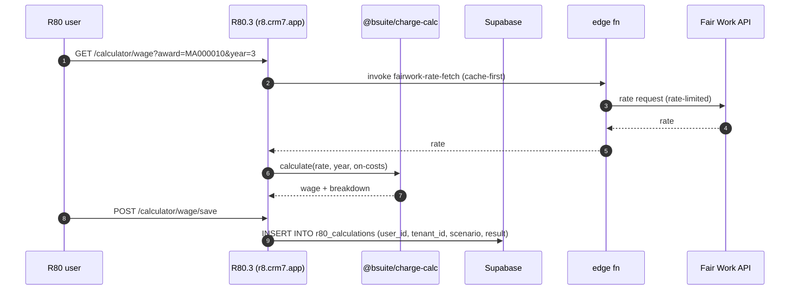

> ## ⚠ SUPERSEDED — 2026-08-17
>
> **This portal sub-plan is superseded by operator rulings D-93…D-98**
> (`../../20260814-portals-operator-rulings-v1.00A.md`, Approved 2026-08-14), and by the
> remediation programme in `../20260814-portals-and-surface-class-remediation-v1.00D.md`.
>
> The rulings decide, on the operator's own authority, several things these sub-plans assumed:
> a field officer is **staff**, not a portal persona; a host sees the **full charge-rate build-up**;
> a host **places staffing orders but does not browse workers**; payslips are a **viewer**; WHS
> questions match AnyTime; and bank/TFN/super are **out of scope** for the portals.
>
> **Cite the D-numbers. Do not re-derive a persona or a permission from this file** — that is the
> exact re-derivation the rulings were written to stop. Retained for its surface inventory.

# Portal — R80.3 Wage Calculator

> Sub-plan of [`../20260506-codehouse-parity-and-platform-360-v1.00W.md`](../20260506-codehouse-parity-and-platform-360-v1.00W.md). Permissions: [`../../../AUTH_CANONICAL.md`](../../../AUTH_CANONICAL.md).

R80.3 is **reader-only** on CRM7-owned `apprentices` (matrix row P2-26). It must persist its own calc state to R80-owned tables. Compliance-critical: wage calculations must be auditable per Fair Work Act + matrix domain N.

## Roles

| Role | Auth source | JWT claim / RLS reference |
|---|---|---|
| `r80_user` | BS OAuth 2.1 PKCE → R80.3 (client `5d804d20-…`) | `tenant_role = 'r80_user'` — read on `apprentices` (CRM7-owned), write on `r80_calculations` (own user) |
| `r80_admin` | BS OAuth 2.1 PKCE → R80.3 | `tenant_role = 'r80_admin'` — read all `r80_calculations` within tenant |
| `gto_admin` | BS OAuth 2.1 PKCE → CRM7 OR R80.3 (cross-app) | shared role; full read across tenant |

## Capability matrix

| # | Capability | Roles | Route | RLS policy (or TODO) |
|---|---|---|---|---|
| 1 | Wage calculator (apprentice rate by year + award) | all r80 roles | `/calculator/wage` | reader-only on `apprentices`, `award_rates` (TODO: audit) |
| 2 | Charge-rate calculator (margin model) | all r80 roles | `/calculator/charge` | uses `@bsuite/charge-calc`; persists to `r80_calculations` (TODO: define table if missing) |
| 3 | BOOT preview (matrix advantage #2 — better-than-Codehouse) | all r80 roles | `/calculator/boot-preview` | calls `@bsuite/charge-calc/boot`; read-only on award rules |
| 4 | Fair Work API rate fetch (matrix domain N + L) | all r80 roles | (calculator pages, server-side) | edge fn `fairwork-rate-fetch` with cache + rate-limit |
| 5 | Calculation history (saved scenarios) | r80_user (own), r80_admin, gto_admin (all in tenant) | `/calculator?tab=history` | `r80_calculations_*` (TODO: audit) |

## Data flow

## Upstream / downstream

| Entity / channel / fn | Direction | Notes |
|---|---|---|
| `apprentices` | read-only (CRM7-owned per matrix row P2-26) | RLS-restricted |
| `award_rates` | read | shared cache |
| `r80_calculations` | read+write (own user) | R80-owned table (TODO: confirm exists) |
| edge fn `fairwork-rate-fetch` | call | cache + rate-limit per matrix domain L |
| `@bsuite/charge-calc` (npm `^0.1.0`) | call (in-process) | shared package |
| `@bsuite/charge-calc/boot` | call | matrix advantage #2 |

## Accessibility (WCAG 2.2)

- Numeric input fields MUST have proper `inputmode="decimal"` + step controls.
- Result breakdown MUST be a table with `<caption>` + scope-attributed headers (screen-reader compliance).
- BOOT preview pass/fail status MUST be surfaced as a status-message live region (not just colour) per [WCAG 2.2 §1.4.1](https://www.w3.org/TR/WCAG22/#use-of-color).
- Award selection MUST be a combobox with proper `aria-controls` + `aria-expanded` semantics.
- Calc errors MUST surface via `aria-invalid` + `aria-describedby` on the offending input.

## Open questions

1. Does `r80_calculations` table exist, or is calc state purely client-side? Confirm; matrix row P2-26 implies it must exist.
2. Is `@bsuite/charge-calc/boot` exposed in R80.3, or only used in CRM7? Audit imports.
3. Fair Work API caching strategy — Redis? Supabase table? edge-function memoization? File issue.
4. Is the calculator's saved-scenario sharing tenant-scoped (gto_admin sees all in tenant)? Confirm RLS.
5. What happens when an apprentice's award changes mid-year — does the calculator surface the correct effective-date rate? File issue (Fair Work-correctness).

## Citations

- [AUTH_CANONICAL.md](../../../AUTH_CANONICAL.md) — internal
- [Fair Work — Pay & Conditions Tool API](https://calculate.fairwork.gov.au/) — operator-pending API access
- [Supabase RLS — JWT claims 2026](https://supabase.com/docs/guides/database/postgres/row-level-security)
- [`@bsuite/charge-calc` npm](https://www.npmjs.com/package/@bsuite/charge-calc)
- [WCAG 2.2 — use of color §1.4.1](https://www.w3.org/TR/WCAG22/#use-of-color)
- [WCAG 2.2 — name role value §4.1.2](https://www.w3.org/TR/WCAG22/#name-role-value)
